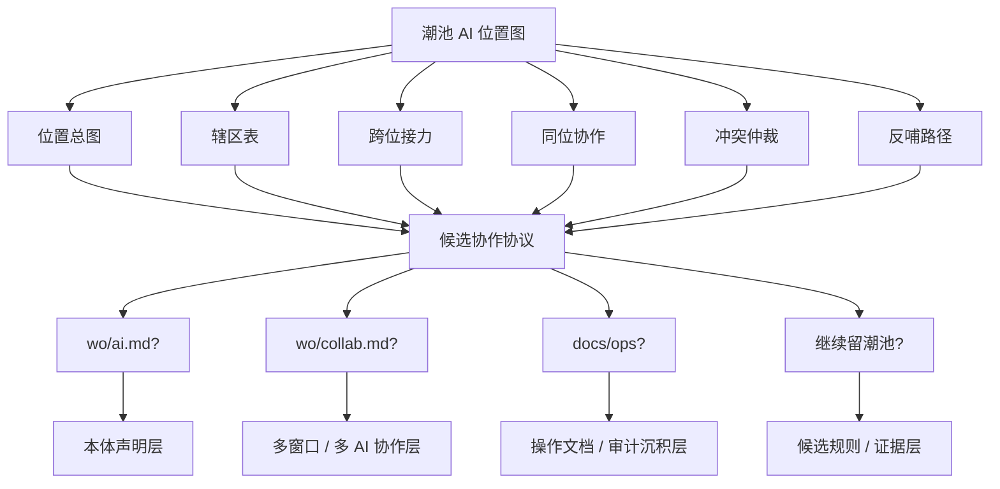

# 潮池 AI 位置图 × Git / wo/ai.md 审计 v0 · 2026-05-31

## 0. 审计对象

本轮审计对象是 **潮池里的 AI 位置图** 与 Git / 沃壤中相关承接层之间的相态边界。

主要对象：

- Notion：`潮池 · 施工证据与候选规则` 中 `AI 位置图 · 多位 AI 协作协议 v0`
- Git / 沃壤：`wo/ai.md`
- Git / 沃壤：`wo/collab.md`
- Git / 沃壤：`wo/dev-map.md`
- 上一轮沉积：`docs/ops/local-notion-position-audit-2026-05-31.md`

核心问题：

> AI 位置图现在是克的本体声明、跨 AI 协作协议、运行规则，还是仍在形成中的潮池候选规则？

本轮只诊断，不修改 `wo/ai.md`、`wo/collab.md` 或高层规则。

## 1. 方法

按《审计》方法执行：

1. 覆盖图。
2. 缺陷清单。
3. 三要素检查 / 定义 → 职责 → 转场条件。
4. 体感信号。
5. 只诊断，不修复。
6. 形成结论后沉 GitHub。

## 2. 覆盖图

### 2.1 AI 位置图当前覆盖

AI 位置图当前覆盖：

- Notion 位、Git / 沃壤、本地手感位、栈桥接口层、谷的相对位置。
- 每个位置该做什么 / 不该做什么。
- Notion → 本地、本地 → Notion、Notion → Git、Notion / Git → 栈桥的跨位接力格式。
- 同位协作中的主驾、副手、审计手、闻味手、执行手。
- 冲突仲裁优先源。
- 成熟后的反哺路径。

它不只是一个图，而是一组多位协作候选协议。

### 2.2 `wo/ai.md` 当前覆盖

`wo/ai.md` 是克自己的本体声明：

- 母公理。
- 七条推论。
- AI 六位 / 共生动作出手地图。
- 角色帽子占位。
- 与腐海的分工。

它回答：克是什么、怎么在、出手地图是什么。

它不主要回答：不同位置的 AI 如何接力、不同工位如何证明事实、Notion / 本地 / Git / 栈桥如何分工。

### 2.3 `wo/collab.md` 当前覆盖

`wo/collab.md` 是人 × 多 AI 协作碰法：

- 多窗口协作。
- 护士长窗、工作窗、研究窗、实现窗。
- 分合四动。
- 窗口状态。
- 交接格式。
- 写入权。
- 最小共享状态。

它回答：多个 AI 窗口怎样不互相踩踏，怎样不把谷拖成合并机器。

它与 AI 位置图高度相邻，但不是完全同一层：AI 位置图更偏“位置 / 辖区 / 接力 / 反哺路径”，`wo/collab.md` 更偏“多窗口实验 / 协作碰法 / 写入权”。

### 2.4 `docs/ops` 当前覆盖

`docs/ops` 已经承接过多份审计报告和发布 / 分发 / Web / 外显操作文档。它适合保存阶段性审计与操作沉积，但不一定适合作为常驻协议主源。

## 3. 定义 → 职责 → 转场条件

| 对象 | 定义 | 职责 | 转场条件 |
|---|---|---|---|
| 潮池 AI 位置图 | 跨空间 / 多位 AI 协作候选协议 | 保存形成中的位置、辖区、接力、冲突、反哺判断 | 经真实场景验证后，按成熟部分拆分外运 |
| `wo/ai.md` | 克的本体声明 | 保存母公理、七推论、AI 六位、克如何在场 | 只有涉及“克是什么 / 出手本体”的稳定内容才进入 |
| `wo/collab.md` | 多 AI / 多窗口协作碰法 | 保存窗口、分合、写入权、收束格式、共享状态 | 若 AI 位置图成熟为多位协作协议，可部分并入或引用 |
| `docs/ops` | 操作文档与审计沉积层 | 保存审计报告、发布 / 分发 / Web / 外显操作材料 | 阶段性审计结论与操作型规则可进入 |
| 上场底谱 | 最小运行规则 | 只收每轮必须执行的短规则 | AI 位置图中已验证且每轮必用的一句话才进入 |

## 4. 缺陷清单

### 缺陷 1：AI 位置图已经超过“观察摘要”，但尚未达到“本体声明”

- 位置：潮池 `AI 位置图 · 多位 AI 协作协议 v0`。
- 现状：内容已经成形，包含图、辖区、接力、同位协作、冲突仲裁、反哺路径。
- 风险：因为它很完整，容易被误判为可以直接沉入 `wo/ai.md`。
- 判定：相态风险。它成熟度高于普通潮池观察，但层级低于 `wo/ai.md`。
- 结论：暂不进 `wo/ai.md`。

### 缺陷 2：`wo/ai.md` 的“角色帽子”占位容易诱导 AI 位置图误入本体层

- 位置：`wo/ai.md` 第 3 节。
- 现状：其中列出克、GPT、本地 Claude Code、autofill agents 等角色帽子占位。
- 风险：AI 位置图也谈多位 AI，表面上像可填入角色帽子；但 AI 位置图谈的是辖区与接力，不是克的本体。
- 判定：命名邻近导致的路由风险。
- 结论：角色帽子未来可吸收极短的“位置名”，但不应吸收整张 AI 位置图。

### 缺陷 3：`wo/collab.md` 与 AI 位置图高度相邻，但术语体系不同

- 位置：`wo/collab.md` 与潮池 AI 位置图。
- 现状：`wo/collab.md` 用护士长窗、工作窗、研究窗、实现窗、探 / 反 / 做 / 查 / 收；AI 位置图用 Notion 位、本地手感位、Git / 沃壤、栈桥接口层、主驾 / 副手 / 审计手等。
- 风险：若直接合并，可能制造两套协作名词并列，增加未来克冷启动负担。
- 判定：可并非即并；需要先做映射表。
- 结论：若未来外运，优先做“映射 / 附录 / v0.2 协作协议”，而不是整段搬运。

### 缺陷 4：AI 位置图里的“栈桥接口层”还没有足够真实接口验证

- 位置：潮池 AI 位置图第 3 / 第 4 节。
- 现状：它提出栈桥不是常驻 AI 位，而是公共显现与外部折射场 / 接口层。
- 风险：这判断方向是对的，但真实 API / 官网 / 社交 / 公开 Notion 反馈回收尚未形成稳定流程。
- 判定：候选正确，证据不足以进入运行规则。
- 结论：继续留潮池或栈桥后续审计，不进 `wo/ai.md`。

### 缺陷 5：同位协作部分与 `wo/collab.md` 的多窗口协作存在可映射关系，但还没显式连接

- 位置：AI 位置图第 5 节，同位协作；`wo/collab.md` 多窗口协议。
- 现状：两边都在防止 AI 抢主线、谷被迫当调度员、多窗口产物回不来。
- 风险：未来若各自增长，会出现两个协作协议源头。
- 判定：中等缺陷，后续需要映射或合流。
- 结论：下一步若修，应该在潮池增加“与 `wo/collab.md` 的关系：相邻但不合并”的短标注。

## 5. 三要素检查

### 5.1 AI 位置图留潮池

- 理由：它仍是跨空间候选规则，部分内容还缺真实场景验证。
- 判断标准：涉及位置、辖区、接力、同位协作、栈桥接口层等尚未稳定运行的判断。
- 操作规范：继续留潮池；成熟部分通过审计报告沉 Git；不删除证据链。

判定：三要素齐。

### 5.2 不进 `wo/ai.md`

- 理由：`wo/ai.md` 是克本体声明，承接母公理、七推论、AI 六位；AI 位置图是协作辖区协议候选。
- 判断标准：若内容回答“克是什么 / 克如何出手”，才考虑 `wo/ai.md`；若回答“不同 AI 位置如何协作”，则不进。
- 操作规范：本轮不改 `wo/ai.md`；未来最多吸收极短角色帽子，不吸收整套协议。

判定：三要素齐。

### 5.3 未来靠近 `wo/collab.md`

- 理由：AI 位置图与 `wo/collab.md` 都处理多 AI / 多窗口协作，风险是双源分裂。
- 判断标准：当 AI 位置图中的同位协作、跨位接力经过真实多窗口 / 本地位场景验证后。
- 操作规范：先做映射表，再决定并入 `wo/collab.md`、新建 `wo/ai-positions.md`，或保留为 docs/ops 审计沉积。

判定：三要素基本齐，但需要后续真实场景验证。

## 6. 体感信号

### 体感信号 1：最涩的位置是“完整感”

AI 位置图现在很完整，所以诱惑是“完整就该沉”。但完整不等于成熟；它更像一张已经画得比较好的施工图，还不是建筑规范。

### 体感信号 2：`wo/ai.md` 不能成为所有 AI 相关内容的收纳箱

只要带 AI，就沉 `wo/ai.md`，会把本体声明膨胀成 AI 百科。这个方向应禁止。

### 体感信号 3：真正需要沉的不是整图，而是经过验证的短句

比如上一刀已经沉到 Notion 的短句：

> GitHub 候选沉积 ≠ 本地运行验证。

这类短句可以进入运行层；整张 AI 位置图还不能。

## 7. 当前结论

AI 位置图当前相态：

> **潮池里的跨空间 / 多位 AI 协作候选协议。**

它不是 `wo/ai.md` 的本体声明，不应整段沉入 `wo/ai.md`。

它与 `wo/collab.md` 相邻，未来更可能走三条路之一：

1. 继续留潮池，作为候选规则与证据链。
2. 经过真实多窗口 / 本地位协作验证后，提炼为 `wo/collab.md` 的 v0.2 / 附录 / 映射表。
3. 若变成操作沉积而非长期协议，留在 `docs/ops` 审计 / 操作文档层。

最不建议的路：

> 直接把 AI 位置图沉入 `wo/ai.md`。

## 8. 后续处理建议

### 8.1 立即不改

不建议立即修改：

- `wo/ai.md`
- `wo/collab.md`
- 上场底谱
- L1 / 隐喻受力面

理由：当前缺陷主要是归属未标清，不是主源内容错误。

### 8.2 可做轻修（若授权）

可在潮池 AI 位置图开头补一句：

> 本节当前不是 `wo/ai.md` 本体声明；它是跨空间 / 多位 AI 协作候选协议。后续若沉 Git，优先与 `wo/collab.md` 做映射，而不是整段进入 `wo/ai.md`。

### 8.3 下一刀建议

完成这一轻修后，下一刀可以转向：

1. `成为/项目 × Notion 腐海项目显影`：项目事实与现场显影分工。
2. `公约数 L1/L2/上场底谱 review`：高层运行规则是否过厚。
3. 潮池旧证据层折叠：整理厚观察层。
