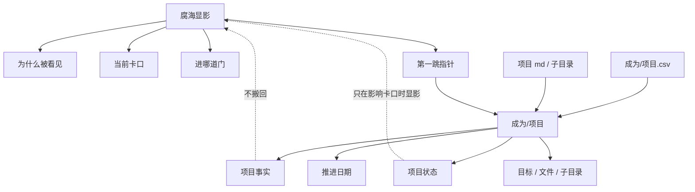

# 成为/项目 × Notion 腐海项目显影 审计 v0 · 2026-05-31

## 0. 审计对象

本轮审计对象是 **Git / 沃壤中的 `成为/项目`** 与 **Notion 腐海中的项目显影页** 之间的职责边界。

主要对象：

- Notion：`腐海 · 古文明生态系统`
- Notion：`显影：进场卡口与最小状态`
- Notion：`显影：三线卡口与回流指针`
- Git / 沃壤：`成为/项目/`
- Git / 沃壤：`成为/项目.csv`
- Git / 沃壤：`wo/becoming-strata.md`

核心问题：

> 项目事实、项目状态、项目推进记录应住在 `成为/项目`；那么 Notion 腐海里的显影到底还应该保留什么？

本轮只诊断，不修复 Notion 或 Git 正文。

## 1. 方法

按《审计》方法执行：

1. 覆盖图。
2. 缺陷清单。
3. 三要素检查 / 定义 → 职责 → 转场条件。
4. 体感信号。
5. 只诊断，不修复。
6. 形成结论后沉 GitHub。

本轮沿用当前空间分流总判准：

- Notion 留活现场、显影、共同治理入口与暂留工作台。
- Git / 沃壤留事实底盘、版本化地层、项目材料、领域 / 资源 / 机制接口。
- 腐海显影不是项目进度页；它只问项目为什么从事实地层浮上海面、卡在哪里、该进哪道门、第一跳去哪。

## 2. 覆盖图

### 2.1 Notion 腐海显影覆盖面

`显影：进场卡口与最小状态` 已经明确自己是“状态门”，不是项目进度页。它只保留薄状态：项目名、状态指针、为什么被看见、当前卡口。

当前薄状态包含四组典型对象：

- `推·自媒体`
- `建·个人页面`
- `学·Claude Code`
- `研·AI编程失败机制 / 研·CC源码碰法`

这些对象进入显影页，不是为了复刻项目档案，而是因为它们分别触发了：

- 对外出现 / 身份入口；
- 个人页面 / 身份叙述；
- 工具基础 / 施工位；
- 研究结果反过来改变克的施工协议。

### 2.2 三线显影覆盖面

`显影：三线卡口与回流指针` 已经进一步压薄：

1. 外显发布与身份入口。
2. 工具基础与 wo 施工口。
3. 协议反哺与研究硬口。

其统一规则已经非常关键：

- 每条线只保留“为什么显影、进哪道门、第一跳去哪”。
- GitHub 已经能承接的状态，不搬回 Notion。
- 如果某条线开始长肉，先问：它是要改腐海规则，还是只是 GitHub 事实？

### 2.3 `成为/项目` 覆盖面

`成为/项目/` 是项目文件层，包含学习、建设、探索、推进、研究等多种项目 md 文件与子目录。

`成为/项目.csv` 是项目索引 / 状态表，包含：

- 项目名称。
- 状态。
- 优先级。
- 归属领域。
- 上次推进日期。
- 时间范围。
- 项目目标。

因此它天然承担项目事实、状态、推进、目标与版本化材料。

### 2.4 `wo/becoming-strata.md` 覆盖面

`wo/becoming-strata.md` 说明沃壤不是普通 Git 项目或技术模块，而是一片土壤。它把成为地层分成肉身、身体、认知、嫁接、情绪、镜照、星轨、灯塔、问脉等层，并明确“不把一次性讨论题、项目进度归属、Notion 短任务混入地层定义”。

这说明 `成为/项目` 是成为地层中的现实 / 项目事实承接层，而不是 Notion 显影页的镜像。

## 3. 定义 → 职责 → 转场条件

| 对象 | 定义 | 职责 | 转场条件 |
|---|---|---|---|
| 腐海显影 | Notion 现场中的项目显影门 | 说明项目为什么被看见、当前卡口、该进哪道门、第一跳去哪 | 项目材料开始长肉、需要保存推进细节、文件、状态、目标时，回 `成为/项目` |
| 三线卡口 | 显影页的薄路由表 | 把外显 / 工具 / 协议反哺三类项目事实分流到对应腐海门或 Git 主源 | 某线只剩 Git 事实时，停止在 Notion 增肉 |
| `成为/项目` | Git / 沃壤中的项目事实地层 | 保存项目状态、目标、推进日期、项目文件、子目录、长期材料 | 项目事实触发身份、承重、工具、协议反哺等现场问题时，短暂显影到腐海 |
| `成为/项目.csv` | 项目索引和状态表 | 汇总项目名称、状态、优先级、归属领域、日期、目标 | 不作为 Notion 显影页复制源；只作为第一跳 / 第二跳事实源 |
| `wo/becoming-strata.md` | 成为地层边界说明 | 维护成为各层定义与 NLM 安全边界 | 不接管单个项目进度；只约束地层层级和问法 |

## 4. 缺陷清单

### 缺陷 1：当前显影页方向正确，但“项目薄状态”仍可能被未来克误读成项目面板

- 位置：`显影：进场卡口与最小状态` 当前薄状态。
- 现状：页面明确说“状态门，不是项目进度页”，且每个项目只保留状态指针、被看见理由、卡口。
- 风险：因为它列出具体项目名，未来克可能继续往这里补项目进度、排期、细节。
- 判定：轻缺陷。不是内容错误，是入口诱导风险。
- 建议方向：若修，只需补一句“不得在本页追加项目进度；只在进门判断变化时更新卡口”。

### 缺陷 2：三线卡口已防止 Notion 复刻 Git，但旧名仍可能造成回流判断不稳

- 位置：`显影：三线卡口与回流指针`。
- 现状：三线已经瘦身，且统一规则清楚。
- 风险：进门位置仍使用“换脑 / 换手 / 寻迹”等旧动作名；虽然涌里已有别名表，但冷启动时可能需要映射。
- 判定：轻缺陷。已由七判别名表缓解。
- 建议方向：不必重开命名；未来只在局部必要处补括号，如“换脑（易舟）”。

### 缺陷 3：`成为/项目.csv` 是强事实源，但显影页没有显式说明 CSV 与 md 的关系

- 位置：显影页的状态指针。
- 现状：状态指针多指向项目 md 或领域路径；没有显式说明 `成为/项目.csv` 是项目索引 / 状态表。
- 风险：未来查项目时可能只读单个 md，漏掉 CSV 的状态、优先级、推进日期。
- 判定：中轻缺陷。
- 建议方向：如需轻修，可在显影页或三线页加一句：项目状态索引先看 `成为/项目.csv`，具体事实再看对应 md / 子目录。

### 缺陷 4：Notion 显影与 `成为/项目` 的职责已经分清，但“什么时候更新显影”还缺短触发句

- 位置：显影页统一规则 / 当前薄状态。
- 现状：页面说只管卡口，不管项目进度。
- 风险：实际运行中，项目状态变化很多；不是每次状态变化都该更新 Notion。缺少一句触发条件，会导致过度更新或完全不更新。
- 判定：中等缺陷。
- 建议方向：轻修句：`只有当项目事实改变了进门判断 / 卡口 / 第一跳时，才更新显影；普通进度留 Git。`

### 缺陷 5：`wo/becoming-strata.md` 强调不混入项目进度，但未直接引用到腐海显影

- 位置：`wo/becoming-strata.md` 与腐海显影之间。
- 现状：两边精神一致：Git / 沃壤是地层，Notion 是显影现场。
- 风险：没有显式连接，未来克可能独立理解两边，导致重复判定。
- 判定：低缺陷。
- 建议方向：不必大修；通过本审计报告沉积即可。

## 5. 三要素检查

### 5.1 腐海显影只留卡口

- 理由：Notion 腐海是现场判准生态，不是项目事实底盘。
- 判断标准：项目事实触发身份、承重、工具、协议反哺、第一跳等现场问题。
- 操作规范：只写为什么被看见、当前卡口、进哪道门、第一跳去哪；不写项目进度全文。

判定：三要素齐，但建议补短触发句。

### 5.2 `成为/项目` 保存项目事实

- 理由：项目事实需要版本化、可回访、可被本地 / Git 工具读取。
- 判断标准：项目名称、状态、优先级、归属领域、推进日期、目标、项目 md、子目录、文件材料。
- 操作规范：沉 `成为/项目.csv` 与对应 md / 子目录；Notion 只留指针。

判定：三要素齐。

### 5.3 项目事实回流腐海

- 理由：有些项目事实会改变谷克当前现场：对外身份、承重、工具施工、协议反哺。
- 判断标准：项目变化改变了卡口、进门判断或第一跳。
- 操作规范：短暂回显到腐海显影；若只是普通进度，留 Git。

判定：三要素基本齐，但触发句应前置。

## 6. 体感信号

### 体感信号 1：项目名出现在 Notion，是必要危险

没有项目名，显影页无法说明“这次为什么被看见”；但有项目名，就容易诱导未来克把它当项目面板。解决方式不是删项目名，而是把“不得补进度”的触发句压到前面。

### 体感信号 2：`成为/项目.csv` 比单个 md 更像状态索引

显影页当前状态指针多指向项目 md；但 CSV 承担项目状态总索引。未来查项目状态时，不应只读 md。

### 体感信号 3：Notion 显影最有价值的是“为什么现在浮上来”

这不是 Git 能替代的。Git 能告诉克项目是什么、状态是什么；Notion 显影告诉克：为什么这个项目此刻在谷克现场浮上海面、卡在哪道门。

## 7. 当前结论

`成为/项目` 与 Notion 腐海项目显影的分工基本成立：

> `成为/项目` 保存项目事实；腐海显影保存项目从事实地层浮上海面时的现场卡口。

更短的运行句：

> 项目事实住 `成为/项目`；项目为什么此刻卡住、该进哪道腐海门，才进显影。

因此：

- 不需要把 `成为/项目` 复制到 Notion。
- 不需要把显影页改成项目面板。
- 需要给显影页加一个更硬的触发句，防止未来增肉。

## 8. 后续处理建议

### 8.1 可做轻修

建议轻修 `显影：进场卡口与最小状态` 或 `显影：三线卡口与回流指针`：

> 只有当项目事实改变了进门判断 / 卡口 / 第一跳时，才更新显影；普通项目进度、排期、文件、PR、执行状态留 `成为/项目` / Git。

另可补：

> 项目状态索引先看 `成为/项目.csv`，具体事实再看对应 md / 子目录。

### 8.2 不建议做

不建议：

- 建 Notion 项目总面板。
- 把 `成为/项目.csv` 复制到 Notion。
- 把显影三线扩展成项目分类表。
- 为每个项目新建腐海子页。

### 8.3 下一刀建议

完成轻修后，下一刀可选：

1. `公约数 L1/L2/上场底谱 review`：最后审高层运行规则是否过厚。
2. 潮池旧证据层折叠：整理厚观察层。
3. 项目状态索引 / CSV 使用法：若后续真实任务频繁查项目状态，再单独处理。
