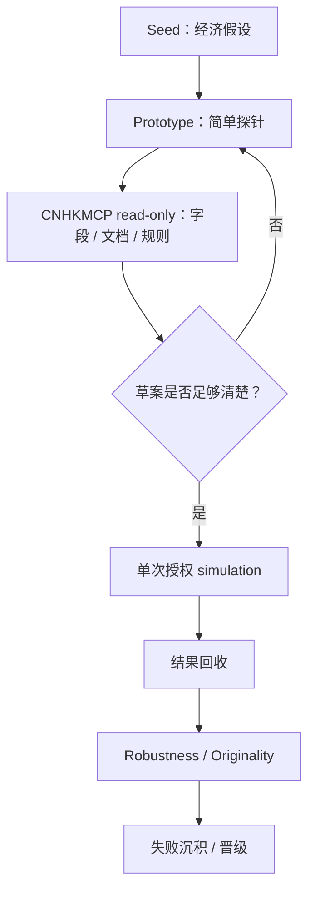

# CNHKMCP 工具过闸审计 v0

来源：Notion《CNHKMCP 工具过闸审计 v0》。沉降时间：2026-06-05。

## r / N / D

- r：CNHKMCP 可能成为 WQB 研究测量仪，但它涉及认证、simulation 与账号边界。
- N：可沉 Git 的是工具过闸审计、权限分层、部署路线与安全边界。
- D：实际凭证、安装输出、工具列表与单次授权 simulation 现场留 Notion / 本地。

## 当前结论

- CNHKMCP 大概率是 WQB 中国区 / 社群里流通度较高的工具之一。
- 公开项目 `worldquant-skill` 明确将它作为 WorldQuant BRAIN MCP 工具来集成。
- 但目前不能确认它是 WorldQuant 官方工具，也未看到官方背书。
- 它涉及账号认证、simulation 创建、可能的 forum / 页面访问，不能直接当成无风险插件接入。
- 当前建议：黄灯偏可用。先按“本地 read-only → 单次授权 simulation → 再考虑 Cloudflare / Notion”的顺序推进。

## 直接安装 vs Cloudflare 部署

### 直接安装

可能路线：本地环境 / Claude Code / Gemini CLI / iFlow 安装 `cnhkmcp`，配置本地凭证或环境变量，先启用 read-only 或低风险工具，simulation 逐次授权。

优点：简单；不需要远程服务；凭证留在本地；适合初始审计。

风险：Notion AI 不能直接持久安装本地 Python MCP 包；若本地客户端配置不清，仍可能误触发 simulation / submit。

结论：初始采用首选本地安装，不先上 Cloudflare。

### Cloudflare 部署

优点：远程连接、OAuth / Access、访问控制、日志、版本化部署，未来适合接 Notion Agent。

风险：WQB 凭证放远程服务会显著提高安全要求；若依赖 Selenium / Chrome，Cloudflare Workers 未必适合；必须做工具白名单，不能暴露全部 write / submit 能力。

结论：Cloudflare 是第二阶段远程 MCP 外壳，不是初始审计入口。

## 推荐路线

### 阶段 A｜本地 read-only 试装

1. 在本地环境安装 `cnhkmcp`。
2. 不输入密码到聊天。
3. 用环境变量或本地 secret 保存凭证。
4. 只测试 list datasets、search data fields、read docs / forum、get existing alpha details、get simulation status。
5. 暂不 create simulation，暂不 submit。

通过条件：能列出工具；能限定 read-only；凭证不暴露；行为可控；能看到调用日志。

### 阶段 B｜单次授权 simulation

1. 只跑 1 个或一小批明确草案。
2. 不自动提交。
3. 记录 alpha expression、settings、simulation id、metrics、失败原因。
4. 结果沉积到 Notion / GitHub。

通过条件：simulation 成功；频率可控；不触发平台异常；结果可回收；可审计。

### 阶段 C｜Cloudflare remote MCP

1. 封装最小 MCP 外壳。
2. 默认只暴露 read-only 工具。
3. write 工具单独开关。
4. create_simulation 加显式确认。
5. submit 永远默认关闭。
6. 用 Cloudflare Access / OAuth 保护。
7. 不在 Worker 明文保存密码。
8. 做日志与速率限制。

## 工具权限分层

| 颜色 | 工具 | 默认策略 |
|---|---|---|
| 绿色 | search data fields, list datasets, read docs, read forum, get existing alpha details, get simulation result / status | 默认可开 |
| 黄色 | create simulation, multiSim / batch backtest, performance analysis, alpha correlation checks | 需明确授权 |
| 红色 | submit alpha, delete / modify alpha, 24/7 auto-mining, scraping / screen scraping, credential export, bulk generation + bulk simulation | 默认关闭 |

## 与 WQB 研究流的关系

CNHKMCP 不替代 Alpha 登山育苗协议，它只是测量仪。

## 暂不做

- 不在聊天里收账号密码。
- 不直接连 Notion Agent。
- 不直接 Cloudflare 部署。
- 不直接 simulation。
- 不 submit。
- 不批量挖 Alpha。

## Ξ 声明 / 折叠审计

- 已沉 Git：审计结论、阶段路线、权限分层、Cloudflare 边界。
- 留 Notion / 本地：真实安装输出、工具列表、账号状态、单次授权记录。
- 不外运：密码、cookie、token、session、平台私密页面全文。
