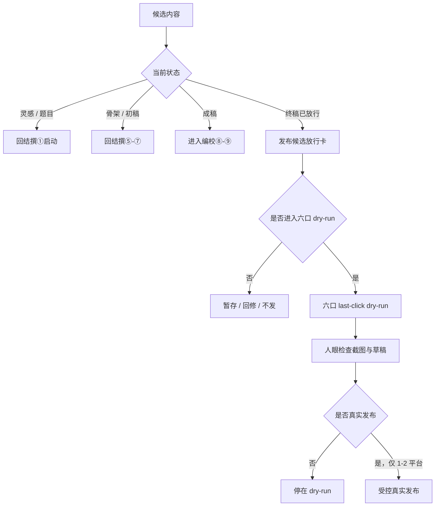

# 发布候选放行卡

用途：在内容线与分发线之间加一道薄闸门，只判断一篇内容是否可以进入六口 last-click dry-run。

本卡不负责写作、不负责编校、不负责真实发布。

## 0. 位置



关系：

- 结撰：负责从意图到成稿 / 标题候选。
- 编校：负责从成稿到终稿放行。
- 分发 safety gate：负责技术上不会误发。
- 本卡：负责判断哪一篇终稿可以进入分发 dry-run。

## 1. 使用时机

仅在以下情况使用：

1. 已有一个或多个候选稿。
2. 需要判断是否进入分发。
3. 不希望在分发线里继续改稿。
4. 不希望把“写完了”自动等同于“该发布”。

不适用：

- 只有灵感：回结撰①。
- 只有骨架：回结撰⑤。
- 只有成稿：进编校⑧。
- 还没标题候选 / 终审：回结撰⑩或编校⑨标题终审。
- 情绪上只是想发泄：先停，不进分发。

## 2. 输入

每个候选稿至少提供：

```text
作品 / 主稿：
当前位置：灵感 / 骨架 / 成稿 / 编辑稿 / 终稿
是否 ⑨ 放行：是 / 否 / 不确定
标题状态：无 / 候选 / 已终审 / 待定
目标平台：
发布目的：
```

可选补充：

```text
不发代价：
发出风险：
是否涉及他人 / 隐私 / 敏感议题：
是否有配图 / 视频 / 链接资产：
```

## 3. 判断表

| 项 | 问题 | 判定 |
|---|---|---|
| 完成度 | 是否已从结撰线产出成稿，并经编校线放行？ | 未放行则不进分发 |
| 读者承诺 | 读者能带走一个清楚判断 / 方法 / 入口吗？ | 说不清则回结撰 |
| 平台匹配 | 最自然先落在哪 1 个平台？ | 无主平台则暂不发 |
| 风险可承受 | 误读、暴露、争议、账号风险、情绪成本是否可承受？ | 不可承受则暂不发 |
| 发布目的 | 记录、测试、建立入口、公开表达、引流中是哪一种？ | 目的不明则暂存 |
| 技术条件 | 是否可先跑六口 dry-run 并人眼检查？ | 不可检查则不真发 |

## 4. 四档结论

### A. 回结撰

适用：

- 题太宽。
- 主张说不清。
- 读者承诺模糊。
- 只有灵感 / 片段 / 骨架。

动作：回到结撰线相应环节，不进入分发。

### B. 进编校

适用：

- 已有成稿。
- 结构大体成立。
- 但尚未完成独立编辑 / 审读 / 校对。

动作：进入编校线，执行 ⑧→⑧.5→⑨。

### C. 进 dry-run

适用：

- 终稿已放行。
- 标题状态可用。
- 有明确主平台。
- 风险可承受。
- 发布目的清楚。

动作：进入六口 last-click dry-run，不真实发布。

### D. 暂不发布

适用：

- 写完了，但当前不适合公开。
- 风险高于收益。
- 目的只是“想清掉它”。
- 谷当前没有承重余量。

动作：暂存，不进入分发。

## 5. 平台初筛

| 内容形态 | 优先平台 | 不建议 |
|---|---|---|
| 长论证 / 系统文 | 公众号 / Medium / Web / Notion | 微博短帖硬塞 |
| 经验贴 / 方法贴 / 图文结构 | 小红书 / 知乎 | 无图硬投小红书 |
| 轻表达 / 观点锚 | 即刻 / 微博 / Telegram | 直接扩成全平台 |
| 低摩擦广播 / 内部递送 | Telegram | 当作正式公开主阵地 |
| 视频内容 | B 站 / 抖音 / YouTube | 无视频资产时假装可发 |

原则：

> 先选一个主平台，最多两个平台。  
> 不默认六口真实发布。  
> 六口只是 dry-run / last-click 检查面。

## 6. 放行输出格式

```text
发布候选放行卡｜YYYY-MM-DD

候选：
当前位置：
⑨ 放行：
标题状态：
建议平台：
发布目的：
不发代价：
发出风险：

判定：A 回结撰 / B 进编校 / C 进 dry-run / D 暂不发布
理由：
下一步：
边界：
```

## 7. 进入 dry-run 后的门槛

如果判定为 C，仍只能进入 dry-run：

```bash
cargo run -- touch "$REAL_FILE"
cargo run -- excrete last --platforms xiaohongshu,telegram,weibo,douban,zhihu,jike
XHS_DRY_RUN=1 TELEGRAM_DRY_RUN=1 TELEGRAM_PROXY=http://127.0.0.1:7890 WEIBO_DRY_RUN=1 DOUBAN_DRY_RUN=1 ZHIHU_DRY_RUN=1 JIKE_DRY_RUN=1 node scripts/wo-excrete.mjs
```

真实发布必须另行满足：

1. 人眼检查截图与草稿。
2. 只选 1 个平台，最多 2 个平台。
3. 谷明确确认真实发布。
4. 发布开关只在当次命令中显式设置。
5. 不写入默认脚本、alias 或长期环境变量。

## 8. 禁止事项

- 禁止在分发线里继续打磨文章。
- 禁止把 dry-run 成功解释为应该真发。
- 禁止把“写完了”解释为“该发布”。
- 禁止默认全平台真实发布。
- 禁止为了完整感补平台。
- 禁止将真实发布开关写入长期环境。

## 9. 最短接续提示词

```text
克，我们走发布候选放行卡。候选稿有 A / B / C。请只判断哪篇适合进入六口 dry-run，不要改稿，不要发布。
```
