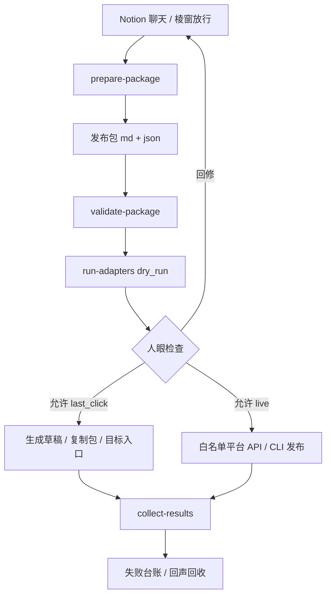

# 外显发布通道铺路 v0

本文件给「聊完以后可以发」这条路立总图。它不写内容计划，不替平台运营，不保存凭证，只定义从发布包到平台外手的输送层。

## 0. 总判准

- Notion：现场、陈列、放行语，不做发布器。
- GitHub `worang`：事实、脚本、配置、Workflow、失败台账。
- 本地 / GitHub Actions：执行介质。
- 平台外手：公开维护的 CLI、官方 API、OAuth 或可审计半自动工具。

一句话：

> 谷只判断能不能发、发到哪些口；管道负责打包、dry-run、last-click、记录失败。

## 1. 工作流

## 2. 三段闸门

| 模式 | 含义 | 默认边界 |
|---|---|---|
| `dry_run` | 只检查、渲染、产生日志 | 不碰平台账号 |
| `last_click` | 生成草稿 / 复制包 / 最后一步说明 | 高风控平台默认到此 |
| `live` | API / CLI 真实发布 | 只给白名单、凭证稳定、平台认可通道 |

`live` 永不作为默认值。任何真实发布都必须由当次命令显式传入，并由平台配置的 `live_allowed` 再次限制。

## 3. 首批通道状态

| 通道 | v0 状态 | 执行策略 |
|---|---|---|
| Web 静态门面 | 已通 dry-run | 生成 `web/content/dispatch.json` 草案 |
| RSS / POSSE | 已通 dry-run | 生成 feed item 草案 |
| Telegram | 半通 | dry-run 生成 payload；live 需 Bot token 与频道确认 |
| Mastodon / Bluesky | 候选 | 优先接 Postiz / Social Publish / 官方 SDK |
| X / LinkedIn | 候选 | 优先 OAuth 工具；无稳定路径则只出草稿 |
| WordPress / Dev.to | 候选 | 优先官方 API / GitHub Action |
| Medium | 候选 | 先草稿；不承诺 live |
| 小红书 / 微博 / 豆瓣 / 知乎 / 即刻 | last-click 优先 | 若外部工具依赖浏览器模拟或逆向 API，不进入自动 live |

## 4. 成功标准

一次发布管道试跑算成功，必须同时留下：

1. 一个发布包 `.md`。
2. 一个发布包 `.json`，通过 schema 校验。
3. 至少一个平台 dry-run 结果。
4. 一份汇总结果 `summary.json`。
5. 若失败，写入失败台账或产生可追加的失败记录。
6. 能回指棱窗陈列位或腐海现场。

## 5. 禁止事项

- 不保存 token、cookie、账号密码。
- 不把浏览器模拟点击包装成低风险自动发布。
- 不默认全平台真实发布。
- 不把 dry-run 成功解释为已经发布。
- 不把平台反馈反向覆盖内容主源。
