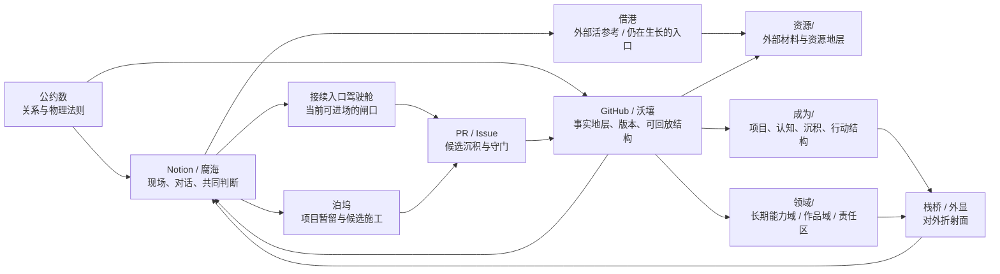
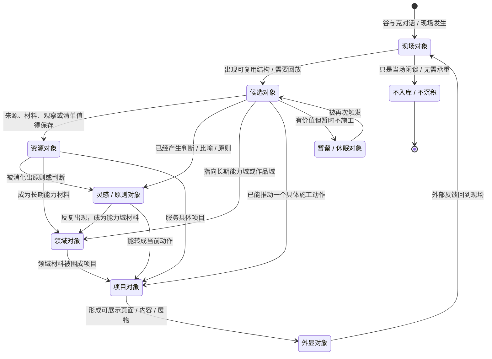
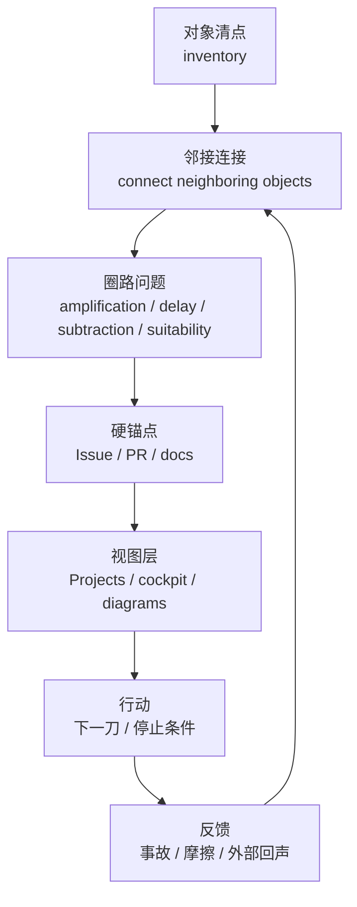
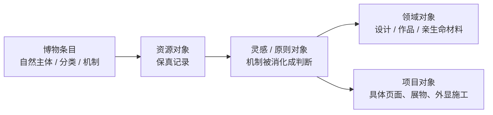

# GitHub 对象状态机与结构图 v0

状态：候选沉积
归属 PR：#227 `docs(ops): add GitHub object inventory v0`
来源：2026-06-13 Notion 对话。谷指出：对象状态机与当前结构图不应放进博物 PR；更合适的归属是 GitHub object inventory 之后的对象连接 / 圈路判断层。

## 0. 放置理由

#227 已经完成“数对象”：入口页、根目录地层、资源、领域、成为、workflow、scripts、Rust CLI、workers、GitHub platform objects、Notion-side connection objects。

它的下一步原句是：

> connect each group of objects to test what circles they can form, where they amplify, where they delay, where they subtract, and which circles are suitable.

所以本文件不再继续数对象，而是把对象之间的第一张结构图与状态机沉积在 #227 分支里，作为“数完之后怎么连接”的第一张草图。

**图例约定（与图谱线义体系的对照）**

> 本文件四张图是**拓扑 / 状态 / 流程**图，不是沉积流图。为与「全空间运行流图 / 全景合体图 / 雕工札记 / 空间飞轮图」共用的线义体系对齐、又不掰弯本图语义，这里显式声明区别：
> - §1 结构图：实线 `-->` ＝**结构连接 / 归属指向**（谁经由谁到达谁），非主沉积链。
> - §2 状态机：箭头 ＝**对象身份的状态转移**（在什么条件下从 A 变成 B），非物料流向。
> - §3 圈路图：实线 `-->` ＝**流程步骤推进**（清点→连接→判断→锚点→视图→行动→反馈，闭环）。
> - §4 博物样例：实线 `-->` ＝**对象在流里被抽出、转身份**的路径。
> 飞轮 / 流图体系里的 `==>`（跨空间主沉积链）、`-.->`（支撑·反向·漏出）、💤（休眠）、⚠（漏点）在本文件四图中**不使用**——这里只画拓扑与转移；承重判断（放大 / 延迟 / 减损 / 适配）留给 §6 接法与飞轮图。

## 1. 当前结构图：Notion × GitHub / 沃壤

### 读法

- **Notion / 腐海**：现场介质。对话、修正、共同判断、临时搭台发生在这里。
- **GitHub / 沃壤**：硬地层。能版本化、回放、被脚本或外手读取的东西落在这里。
- **PR / Issue**：候选沉积与硬锚点。PR 放候选合流；Issue 放事实、下一步、停止条件、事故。
- **资源 / 领域 / 成为**：不是 PARA 盒子，而是对象在不同成熟度与功能下的居所。
- **栈桥 / 外显**：不是资料库，而是把内部结构折射成外部能看懂的页面、内容、展物。

## 2. 对象状态机

### 读法

一个对象不因为“属于某个库”而固定身份。它的身份取决于此刻承担什么功能：

- 能保留来源和材料：资源对象。
- 能产生判断：灵感 / 原则对象。
- 能长期训练能力：领域对象。
- 能推动施工：项目对象。
- 能给外部人看懂：外显对象。

这张状态机是 #227 inventory 之后的第一层连接：不是再数对象，而是看对象怎样改变身份、怎样形成圈。

## 3. 对象圈路：从清点到运行

### 读法

#227 的下一步不是把对象压缩成理论，而是逐组连接：

1. 找一组对象。
2. 找它的邻接对象。
3. 问它能形成什么圈。
4. 判断这个圈的放大、延迟、减损、适配性。
5. 如果值得承重，再放到 Issue / PR / docs。
6. 视图层只负责看见，不负责替事实存在。

## 4. 博物在这张图里的位置

博物不是本文件的主角。它只是说明对象状态机为什么有用的一个样例。

这也校正了前一轮偏差：博物条目的价值不是被过早治理得更完整，而是在对象流里必要时被抽出来，转成灵感、领域或项目材料。

当前最小句：

> 先保真，后迁移；迁移不强迫，强迫就停。

## 5. 与 #231 的关系

#231 已经开出“博物”分支，其中“博物治理写得有点满”这个发现不是废料，未来可能有价值，所以不删除。

但对象状态机和结构图的合适归属不是 #231，而是 #227：

- #231 留作博物方向的候选沉积，保留“过早治理 / 未来可能有价值”的痕迹。
- #227 承接对象清点之后的结构图、状态机与圈路判断。

一句话：

> 博物分支保留为局部发现；对象图沉到对象清点 PR。

## 6. 后续最小接法

下一步如果继续 #227，不要扩成总理论。只挑一个对象组试跑，例如：

- `PR / Issue / docs`：候选沉积、硬锚点、事实地层之间的圈。
- `.github/workflows / scripts / 资源/_registry`：自动化捷径与资源守门之间的圈。
- `成为/项目.csv / Issue / 接续入口驾驶舱`：项目对象如何在 Notion 与 GitHub 间变换身份。

每次只问四件事：

1. 它放大什么？
2. 它延迟什么？
3. 它减损什么？
4. 它适合我们吗？
