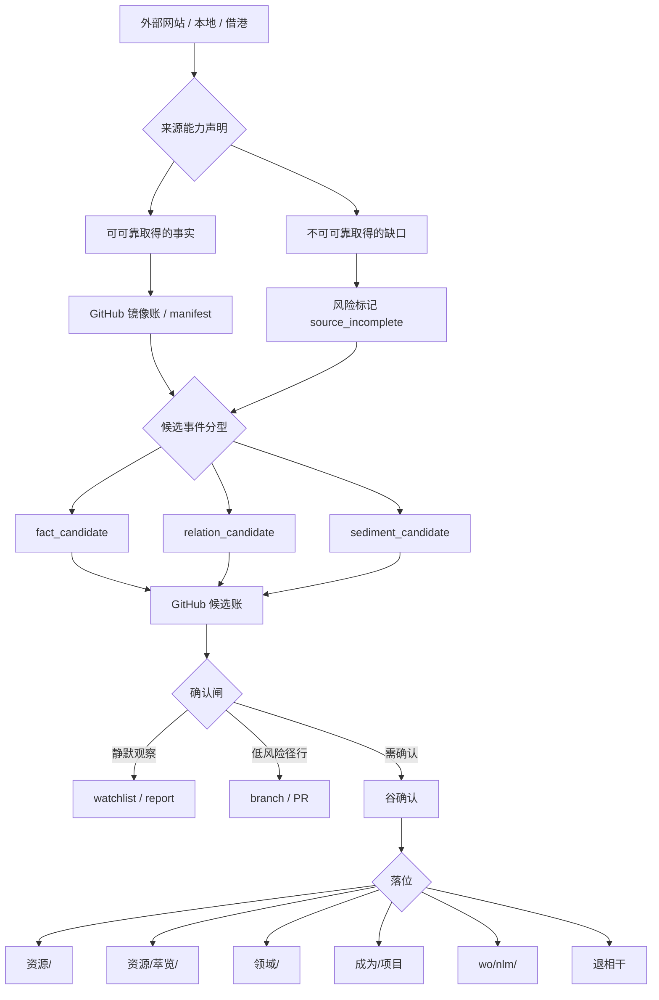

# 资源更新候选事件与确认闸 v0

> 本文是 `资源/资源更新宪法 v0.md` 的操作接口页。宪法回答“为什么不能乱更新”，本文回答“外部来源来的变化如何进入 GitHub、如何排队、如何过闸、如何落位”。

## 0. 总判准

资源更新的主控权放在 GitHub，而不是放在外部平台，也不是放在本地临时目录。

```plain text
外部平台负责发生；
GitHub 负责记账；
候选事件负责排队；
谷确认负责判断；
沃壤结构负责沉积。
```

本地材料可以作为暂存、导出、探针、缓存、脚本运行现场，但默认不作为最终事实账本。若一条资源变化值得长期保存、复核、批处理、回滚、协作或跨工具复用，应优先进入 GitHub 管理的文本、清单、manifest、报告或候选事件文件。

## 1. 负责范围

本文负责定义：

- 多来源资源变化如何先生成候选事件。
- 候选事件如何分型、排队、确认、落位。
- GitHub 在资源更新机制中的主账本地位。
- 本地、外部网站、Notion 借港、NotebookLM、BibiGPT、GetNote、Eagle、Steam、Apple Music、豆瓣、链接库等来源如何接入。
- 哪些信息应写进 GitHub，哪些只能暂存在外部或本地。
- 如何避免因为外部网站拿不到数据而丧失主动权。

本文不负责写同步代码、设计数据库、批量迁移资源、自动抓取外部平台，也不自动写回任何外部平台。

## 2. 为什么 GitHub 优先

外部网站常见问题：

- 用户拿不到完整数据。
- API 权限有限或随时变化。
- 页面结构会变。
- 收藏、播放、观看、下载等状态不可可靠导出。
- 平台可以下架、限流、封禁、改接口。
- AI 服务生成的摘要、问答、转录可能不能稳定回取。

因此沃壤不应把资源更新主权放在外部平台。

GitHub 的优势是：

- 可版本化：每次变更都有 commit。
- 可回滚：错误判断可以撤回。
- 可审计：候选、确认、沉积有历史。
- 可批处理：Markdown / CSV / JSONL / manifest 可被脚本读取。
- 可跨工具：NotebookLM、CLI、MCP、搜索、审计都能接入。
- 可长期保存：比外部平台状态更接近沃壤自己的记忆层。
- 可分支试验：候选机制可以先在 branch / PR 中试压，不污染 main。

简式原则：

```plain text
外部能拿到什么，算证据；
GitHub保存什么，才算沃壤可复核事实；
谷确认什么，才算沃壤判断。
```

## 3. 四账分离

资源更新不应直接从外部状态跳到主库。中间至少分四种账。

| 账 | 记录什么 | 默认位置 | 是否可自动生成 | 是否代表谷判断 |
| --- | --- | --- | --- | --- |
| 镜像账 | 外部平台 / 本地导出的原始事实 | `资源/_source/`、`资源/_douban/`、source-specific manifest | 可以 | 否 |
| 候选账 | 某个事实可能意味着一次更新 | `docs/ops/` 报告、`资源/_candidates/`、PR diff | 可以 | 否 |
| 主库账 | 沃壤承认的资源身份、状态、位置 | `资源/`、manifest、稳定清单 | 不应无确认自动生成 | 部分代表 |
| 沉积账 | 资源长进领域、项目、source pack 或作品结构 | `领域/`、`成为/项目`、`wo/nlm/`、`资源/萃览/` | 必须有规则或确认 | 是 |

四账分离的目的：允许外部事实大量进入，但不让它们直接污染主库判断。

## 4. 候选事件三分法

所有来源先归入三类候选之一。

### 4.1 `fact_candidate`

记录“发生了什么”。

适合：

- 豆瓣状态变化。
- Apple Music 最近播放 / 加入资料库。
- Steam 愿望单 / 已拥有 / 游玩时长变化。
- Eagle 新增素材。
- BibiGPT 生成摘要或 transcript。
- GetNote 新增摘录。
- NotebookLM source pack 变化。
- 链接 alive / dead / redirected。

不可直接推出：喜欢、重要、沉积、项目归属。

### 4.2 `relation_candidate`

记录“它和谁有关”。

适合：

- 同一资源多入口。
- BibiGPT 摘要、YouTube 链接、字幕文件指向同一视频。
- 豆瓣书目、本地 PDF、GetNote 摘录、NotebookLM source 指向同一本书。
- Eagle 素材与项目文件夹、网页来源、作品输出有关。
- 链接库中重复 URL、canonical URL、redirect 后同源。

不可直接完成：合并主身份、删除重复项、改主标题、改主路径。

### 4.3 `sediment_candidate`

记录“它可能该长到哪里”。

适合：

- `资源/BibiGPT/` → `资源/萃览/`。
- `资源/` → `领域/`。
- `资源/` → `成为/项目`。
- 借港材料 → GitHub。
- NotebookLM source pack → `wo/nlm/`。
- 链接 → 可引用材料。
- GetNote 摘录簇 → 领域前体。

必须回答：为什么不是噪声、未来怎么找、服务哪个领域 / 项目 / 接法、是否需要谷确认。

## 5. 候选事件最小格式

```yaml
event_id: source-yyyyMMdd-HHmmss-shortid
event_time: 事件发生或被发现时间
candidate_type: fact_candidate | relation_candidate | sediment_candidate
source_system: douban | apple_music | steam | eagle | bibigpt | getnote | notebooklm | links | manual | other
source_capability: 该来源可靠提供什么事实
source_limit: 该来源不能可靠提供什么
source_ref: 外部链接 / 平台 ID / GitHub 路径 / 本地路径 / Notion 页面 / 文件名
resource_title: 资源标题
resource_type: book | movie | music | game | video | image | webpage | note | dataset | other
external_state: 外部平台原始状态
observed_change: 本次观察到的变化
evidence: 证据摘要
worang_candidate_state: 候选沃壤状态
suggested_destination: 资源/ | 资源/萃览/ | 领域/ | 成为/项目 | Notion借港 | wo/nlm/ | 退相干
requires_gu_confirmation: true | false
confirmation_reason: 为什么需要或不需要谷确认
risk_flags:
  - no_writeback
  - no_auto_merge
  - no_auto_delete
  - no_auto_judgment
  - source_incomplete
next_action: observe | report | ask_gu | draft_pr | merge_review | sediment_review | decohere
```

压缩格式：

```plain text
[类型] 来源｜资源名｜变化：x｜证据：y｜候选：z｜建议去处：p｜需谷确认：是/否｜下一步：q
```

## 6. GitHub 落位原则

### 6.1 默认落位

| 内容 | 优先 GitHub 位置 | 说明 |
| --- | --- | --- |
| 总规则 / 接口 | `docs/ops/` | 操作治理、流程、确认闸 |
| 资源宪法 | `资源/` | 资源层自身的长期规则 |
| 外部镜像 manifest | `资源/_source/` 或具体 `_douban/` 等 | 保存可复核事实，不代表判断 |
| 候选事件报告 | `docs/ops/` 或 `资源/_candidates/` | 若偏流程审计放 `docs/ops/`；若偏资源批处理放 `资源/_candidates/` |
| 已消化材料 | `资源/`、`资源/萃览/` | 可检索、可处理、可复用 |
| 领域证据 | `领域/` | 已进入领域判断 |
| 项目材料 | `成为/项目` 或项目目录 | 绑定具体推进 |
| NotebookLM source pack | `wo/nlm/` | 可作为 source-grounded 问答材料 |

### 6.2 本地轻量化

本地只承担：

- 临时下载。
- 手工导出。
- OCR / 转码 / 字幕 / CSV 清洗。
- 私密凭据与不能入库的缓存。
- 大文件或版权敏感文件的临时处理。

本地不承担：

- 长期主账本。
- 唯一资源身份。
- 唯一候选事件记录。
- 唯一确认记录。
- 无 GitHub 影子的沉积判断。

若一个本地结果值得保留，应至少把它的 manifest、摘要、来源、生成时间、处理方法或候选事件写入 GitHub。

## 7. 来源能力声明

每个外部来源接入前，都必须先声明能力，而不是假装全知。

### 7.1 能力声明模板

```yaml
source_system: 来源名
can_observe:
  - 可靠可取字段
can_infer_only_weakly:
  - 只能弱推断字段
cannot_observe:
  - 拿不到或不可靠字段
user_control_level: high | medium | low
preferred_worang_landing: GitHub path or candidate layer
writeback_policy: never | manual_only
confirmation_policy: 哪些必须谷确认
failure_mode: API 不可用 / 页面变化 / 权限不足 / 数据缺失时怎么办
```

### 7.2 默认判断

| 来源 | 用户掌控度 | 默认权重 | 接入方式 |
| --- | --- | --- | --- |
| GitHub | 高 | 主账本 | 规则、manifest、候选、沉积、审计 |
| 本地 | 中 | 临时处理场 | 导出、缓存、转码、清洗；结果回 GitHub |
| Notion 借港 | 中 | 工作台 / 离港点 | 人工阅读、整理、确认；成熟后回 GitHub |
| 豆瓣 | 低到中 | 外部事实源 | mirror / manifest；不直接判决 |
| Apple Music | 低 | 弱事实源 | 先判 API 能力；播放不等于重要 |
| Steam | 中 | 外部事实源 | playtime / owned / wishlist 只进候选 |
| Eagle | 中 | 外部资产索引 | manifest 优先；不搬全库 |
| BibiGPT | 中 | 取水 / 转录源 | 摘要和 transcript 入候选，不等于消化 |
| GetNote | 中 | 摘录事实源 | recent-window / registry_candidate |
| NotebookLM | 中 | source pack / grain probe | 粒度证据，不给最终判断 |
| 链接库 | 中 | 入口 / 活性源 | alive 不等于有价值 |

## 8. 确认闸

### 8.1 可自动生成，但不能自动沉积

- 新外部入口。
- 新播放 / 观看 / 游玩 / 收藏记录。
- 新摘要 / transcript / source pack。
- 链接可访问性变化。
- 疑似重复。
- manifest 新增行。
- 外部标签 / 文件夹变化。

### 8.2 必须谷确认

- 写入或改动主库身份。
- 改评价。
- 合并主身份。
- 删除、归档、退相干。
- 从 `资源/` 升到 `领域/` 或 `成为/项目`。
- 把外部 AI 摘要视为沃壤判断。
- 把外部消费状态视为“谷已经消化”。
- 高噪声批量导入。

### 8.3 可低风险径行

仅限满足全部条件：

1. 不改主库判断。
2. 不删除、不合并、不覆盖。
3. 不代表谷评价。
4. 可回滚。
5. 只增加候选、manifest、报告、索引或观察记录。
6. 变更发生在 branch / PR，或发生在明确允许的候选层。

## 9. PR / branch 工作法

资源更新机制优先通过 GitHub branch / PR 试压。

推荐流程：

```plain text
观察外部变化
→ 生成候选事件 / manifest / 报告
→ 新建 branch
→ 写入 GitHub 候选层
→ PR 审阅
→ 谷确认是否沉积
→ 决定 merge / 修改 / 退相干
```

PR 标题建议：

```plain text
docs: add resource update candidate report yyyy-mm-dd
resources: add bibigpt capture candidate <name>
ops: audit link candidates yyyy-mm-dd
```

PR body 必须说明：

- 来源。
- 是否只做候选。
- 是否触及主库。
- 是否需要谷确认。
- 不做什么。
- 后续去处。

## 10. 各来源接入总线



## 11. 反依赖外部平台原则

1. 能导出的，导成 GitHub 可读的 manifest。
2. 不能导出的，只当低置信观察，不当主事实。
3. 不能稳定复取的，不作为唯一证据。
4. 外部平台状态不能覆盖 GitHub 中已确认的沃壤判断。
5. 外部平台丢失或不可访问时，GitHub 中的 manifest、摘要、候选事件与沉积记录仍应能说明资源来龙去脉。
6. 若平台只能提供入口，不提供行为数据，则只记录入口，不伪造接触事件。
7. 若平台能提供行为数据，也只说明行为发生，不说明价值成立。

## 12. 一句话接口

```plain text
本地轻，GitHub重；
外部轻，候选重；
事实轻，确认重；
消费轻，沉积重。
```
