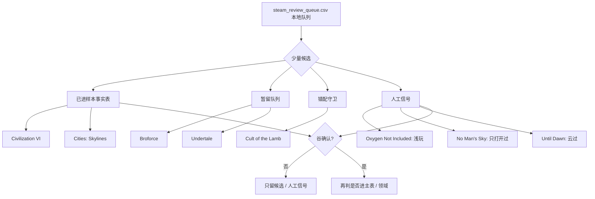

# Steam → 资源/游戏 下一批候选判定 v0

## 负责范围

本页承接 Steam 探针 v0 跑通后的下一批少量候选讨论。它只做候选分流，不直接写入 `资源/游戏.csv`，也不把 Steam 外部事实升格为谷的人工判断。

它负责：

- 从 `steam_review_queue.csv` 的少量条目中挑出下一批可讨论对象。
- 标注游戏形态候选、可能落位和确认门槛。
- 记录为什么暂不全量导入 Steam 库。
- 记录谷补充的人工信号，但仍不自动写主表。

它不负责：

- 不提交 `资源/_steam/` 本地输出。
- 不新增全量 Steam-only 主表条目。
- 不把 Steam 时长等同于重要性。
- 不把 Steam 时长 / 成就自动等同于通关。
- 不覆盖谷的人工判断。

## 候选分流原则

| 分流 | 含义 | 是否写主表 |
| --- | --- | --- |
| `sample_fact_candidate` | 可先进入 `docs/ops/steam-game-resource-facts-sample-v0.csv`，作为 v0 外部事实 / 待确认事实样本 | 否 |
| `hold_queue` | 暂留 `资源/_steam/steam_review_queue.csv` 本地复核队列 | 否 |
| `possible_main_after_gu_confirm` | 可能进入 `资源/游戏.csv` 主表，但必须谷确认 | 仅确认后 |
| `guard_only` | 当前主要价值是校准错配守卫 | 否 |
| `manual_signal_only` | 谷给出轻量人工信号，只记录口径，不进入主表 | 否 |

## 已进入样本事实表候选

| 游戏 | 当前建议 | 形态候选 | 可能落位 | 为什么不自动入主表 | 需要谷确认什么 |
| --- | --- | --- | --- | --- | --- |
| Sid Meier's Civilization VI | 已进入样本事实表候选 | 混合型：单局有限层 + 长期策略循环 | `sample_fact_candidate`，后续可能进主表 / 领域游戏设计 | Steam 高时长只能证明外部接触事实，不等于重要性、通关或系统沉积 | 是否确认为玩过；是否有单局胜利 / 多局经验；是否有机制研究价值 |
| Cities: Skylines | 已进入样本事实表候选 | 无限型 / 混合型：城市模拟、建造、系统经营 | `sample_fact_candidate`，后续可能进主表 / 领域游戏设计 | 建造模拟通常不写通关；时长不等于重要性 | 是否确认为长期玩过；当前是暂停、退坑还是周期回访；是否有机制研究价值 |

## 谷已补充的人工信号

| 游戏 | 谷补充 | 当前解释 | 建议落位 | 不自动入主表的原因 |
| --- | --- | --- | --- | --- |
| Oxygen Not Included | 的确玩过，但玩的不深，都是初级进去 | 可记为浅玩 / 初级体验；不推出长期玩过、重要性、系统沉积或通关 | `manual_signal_only`，后续如需要可进样本事实表候选 | 体验深度不足，当前更适合校准“玩过但不深”的状态口径 |
| No Man's Sky | 的确只打开过，然后没怎么玩 | 可记为打开 / 轻触；不应计为真正玩过或长期探索 | `manual_signal_only` 或继续 `hold_queue` | 仅打开不足以进入主表，也不足以作为无限探索经验 |
| Until Dawn | 看过别人云过 | 可记为云过 / 看过实况，不是亲自游玩 | `manual_signal_only`，不走 Steam 事实 | 云过是观看经验，不是 Steam owned / played 或亲自通关事实 |

## 仍暂留队列的候选

| 游戏 | 当前建议 | 形态候选 | 可能落位 | 为什么不自动入主表 | 需要谷确认什么 |
| --- | --- | --- | --- | --- | --- |
| Oxygen Not Included | 已有浅玩信号，暂不进主表 | 无限型 / 混合型：生存工程、系统模拟 | `manual_signal_only`，后续可视需要转样本事实表候选 | Steam owned / played 和浅玩都不能自动推出沃壤价值 | 是否有系统设计 / 机制研究样本价值；是否值得作为资源记录 |
| Cult of the Lamb | 中优先，先守卫 | 有限型 + 经营循环的混合型候选 | `guard_only` 后再决定是否进样本事实表 | 曾触发错配风险；不能映射到丁丁历险记 | 是否确认为玩过；是否应进入主表；是否有叙事 / 机制回声 |
| Broforce | 中低优先 | 有限型 / 关卡动作候选 | `hold_queue` | 若只是 Steam 条目或轻触，不足以入主表 | 是否有明确玩过 / 合作 / 回声；否则暂留队列 |
| No Man's Sky | 已有“只打开过”信号，暂不进主表 | 无限型 / 沙盒探索 | `manual_signal_only` 或 `hold_queue` | 无限探索类不写通关；只打开不代表探索经验或沉积 | 是否未来真正玩过；是否有探索 / 系统 / 世界生成方面回声 |
| Undertale | 高优先但必须人工判断 | 有限叙事型 / 多路线结构 | `sample_fact_candidate`，后续可能进主表 | 完成路线、价值用途和是否入主表都不能由 Steam 自动推断 | 是否玩过 / 通关；走过哪些路线；是否作为叙事 / 作品参考 |

## 本轮推荐

本轮只把 2 个高时长 / 高校准价值条目放进样本事实表候选，暂不全量处理七个：

1. Sid Meier's Civilization VI：校准高时长、混合型、非通关。
2. Cities: Skylines：校准无限型 / 建造模拟类状态口径。

谷新补充的三条人工信号先只进文档口径，不追加写入样本事实表：

1. Oxygen Not Included：浅玩 / 初级体验。
2. No Man's Sky：只打开过，没怎么玩。
3. Until Dawn：云过，不是亲自游玩。

`Cult of the Lamb` 本轮更适合先作为错配守卫样本；`Broforce` 与 `Undertale` 暂留队列，等谷给出更明确回声再写。

## 写入原则

如果后续写 `docs/ops/steam-game-resource-facts-sample-v0.csv`，优先只写外部事实字段：

- `title`
- `fact_source=steam_review_queue_v0`、`steam_probe_v0` 或 `manual_signal_v0`
- `steam_appid`，仅限 Steam 事实可信时
- `steam_owned`
- `steam_playtime_total_min`
- `steam_last_played_at`
- `external_sources=steam` 或 `external_sources=manual`
- `experience_source=steam_candidate`、`manual_signal` 或 `watched_playthrough`
- `status_confirmed=no` / `yes`
- `decision_note`

必须谷确认后才能写：

- `game_form`
- `finite_completion_status`
- `ongoing_play_status`
- `value_usage`
- 任何表示喜欢、重要、通关、沉积或项目归属的判断。

## Mermaid

