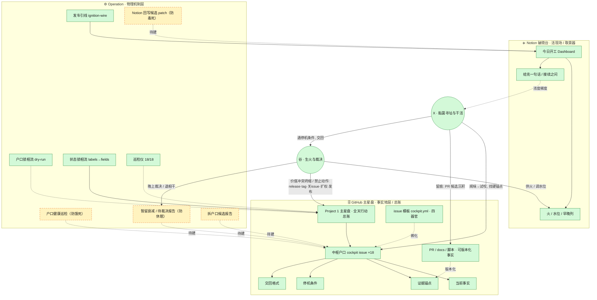

# 潮汐体系 · 大一统图 v0（已建 / 图纸 / 待核）

> 日期：2026-06-17（2026-06-21 更新：issue 模板四器官 待核→已建；红线对齐价值之书——「不可逆」退役，交还判据=价值冲突不可约；Notion 独立大一统图页已并入《星盘 · 全能指路标》，本文件升为该详图唯一事实源，星盘第一跳指向此处）  
> 定位：这是星盘的一个局部承重子图，不是总星盘；它专门说明 Notion 破晓台 × GitHub 主星盘 × cockpit issues × Operation 脚本如何转起来。星盘只放第一跳指针，机制详图（mermaid / 三态表 / 明修 PR / 红线）以本文件为准。

## 0. 读图纪律

```text
实线 = 已经在跑的机制
虚线 = 还在图纸上、未来几天要明修的 PR
红框 = 查无此物、需先核实
```

把它当验收单是毒；当施工图才是车。

## 1. 与星盘的关系

星盘回答的是：

```text
东西先去哪、凭什么暂留、何时外运。
```

本图回答的是：

```text
已经进入“腐海 / 破晓台 / GitHub 主星盘”这一条行动链的东西，如何被发车、对账、巡检、候选、交回。
```

所以它不是星盘的替代物，而是星盘里两条边的展开图：

```text
腐海：行动户口不在这里长期居住 → 变成行动户口时进入 GitHub Project 1
沃壤：需要保真、迁移、运行、回放时进入 Git / 沃壤
```

本图正好解释这条转换链：

```text
Notion 破晓台（早晨取景器）
→ GitHub 主星盘（全天行动总账）
→ cockpit issues（中枢户口）
→ docs / PR / scripts（可版本化事实地层）
→ 晚上裁决 / 退相干 / 明修 PR
```

## 2. 当前大一统图



## 3. 三态对照表

| 机制 | 状态 | 当前实况 |
|---|---|---|
| 发车引线 ignition-wire | 已建 | 每天 04:00 自动从 open 中枢户口烘焙 `docs/cockpit/ignition-wire.md`，只推分支不碰 main |
| 户口锁相流 dry-run | 已建 | `account-phase-lock-dry-run.mjs` 读 mapping + issues 出对账报告，不写任何东西 |
| 状态锁相流 | 已建 | `status-phase-lock-from-labels.sh` 把 labels→主星盘字段，默认 dry-run，`RUN_WRITE=1` 才写 |
| 巡检仪 | 已建 | 2026-06-13 报告 18/18 对齐，0 冲突 0 缺失，只读 |
| 中枢户口 ×18 | 已建 | label: cockpit 的 issue，已挂主星盘 |
| PR 门禁 | 已建 | PR 模板写死：open 是候选沉积，CI 通过≠放行，克默认不自合 |
| 户口健康巡检 | 图纸 | 当前最硬缺口：还没有脚本检查每个户口是否填满四器官 |
| 暂留衰减 / 待裁决报告 | 图纸 | 方向：Last touched aging + 退相干候选，但不自动关 issue |
| Notion 回写候选 patch | 图纸 | v0.1/v0.2 路线已写在文档，绝对基岩里仍属“尚未打开” |
| 拆户口候选报告 | 图纸 | 只生成候选，不自动 open issue |
| issue 模板四器官 | 已建 | `.github/ISSUE_TEMPLATE/cockpit.yml` 在 main，四器官（当前事实 / 证据锚点 / 停机条件 / 交回格式）均为必填字段，另含 Morning prompt（选填）+ waterline/lane 下拉。2026-06-21 核实；无 action.yml / metabolism.yml，四器官由 cockpit.yml 单独承载 |

## 4. 未来几天明修 PR 清单

### PR-1｜中枢户口健康巡检（防饿死）

- 做什么：遍历每个 open cockpit issue，检查是否有 waterline / lane / Morning prompt / 当前事实 / 证据锚点 / 停机条件 / 交回格式。
- 输出：`OK / MISSING_LABEL / MISSING_MORNING_PROMPT / MISSING_FACTS / MISSING_EVIDENCE / MISSING_STOP_CONDITION / MISSING_HANDOFF_FORMAT / STALE` 报告。
- 边界：只读，不写 issue、不写主星盘、不写 Notion。

### PR-2｜发车引线升级：从“列卡片”到“列可开工条件”（防干死）

- 做什么：发车引线分三段——“今日可开工（料齐）”“今日在烧但缺料”“候补”。
- 意义：把“X 该不该问谷”变成判断：缺料→先寻址；缺停机条件→小半径试咬；撞价值冲突或禁止动作→交回。
- 边界：仍只读 issues、仍只推分支不碰 main。

### PR-3｜暂留衰减 + 待裁决队列（防休眠）

- 做什么：`lane:暂留 + Last touched > N 天 → 晚上报告`；连续 N 次巡检无变化 → 生成退相干候选。
- 边界：只生成候选与队列，不自动退相干、不自动关 issue，最终裁决交谷。

### PR-4｜Notion 回写候选 patch（防毒死，分两步）

- v0.1：只生成“建议改哪里”的候选 patch，不写 Notion。
- v0.2：满足 token / data source / `writeback_allowed:true` 才安全回写有限字段（GitHub / 当前状态 / 接续之问 / 给克一句话 / 晚上待判断）；不写正文、不删内容、不移动页面、不改权限。

### PR-5｜拆户口候选报告

- 做什么：对 `建·苗圃外伸 → #208`、`探·合约预扫描产品化 → #204` 这类并户候选，生成“拆/不拆的代价 + 建议 + 等谷裁决”。
- 边界：不自动 open 新 issue。

## 5. 红线

```text
X 自治区：闻味、试咬、加载硬锚点、写文档、改 docs、提 PR、谷已明示授权时代为合并——推进到可验证落点。
唯一交还给谷的：价值冲突且不可约（价值排序 / 身份 / 署名 / 公共后果 / 关系后果 / 现实坍缩）。
实轴三类必停：仓库 / 工具 / required checks 阻塞；合并会触发已禁止动作（release / tag / 关 issue / 扩权 / 发布）；出现新价值对冲。
「不可逆」已退役（见 Notion《X · 价值之书》§五）——单纯合并 PR 不是必停项。
```

## 6. 给其他 AI 的一句话

车不是一个名字，是这些正在跑的脚本 + 限制它的红线 + 户口里的必填字段。读这张图时：先认实线（已能转），再认虚线（未来几天明修），最后认红框（先核实）。不要把虚线当已建，那是今天最大的毒。
