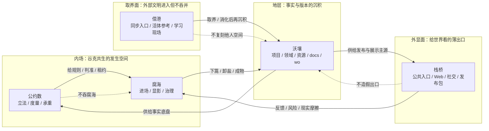
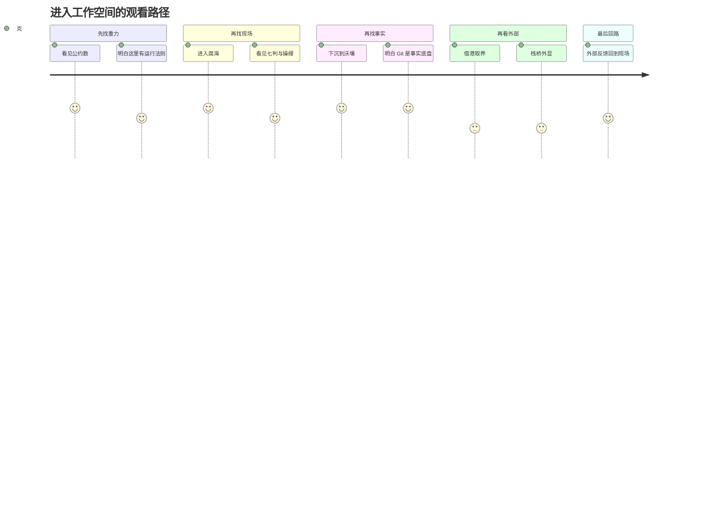
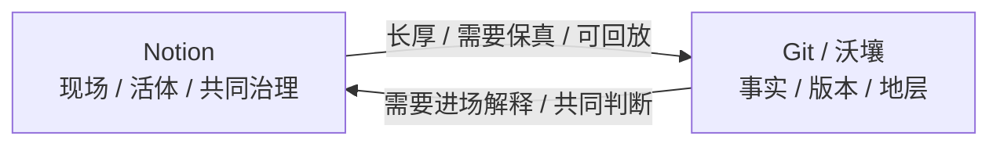
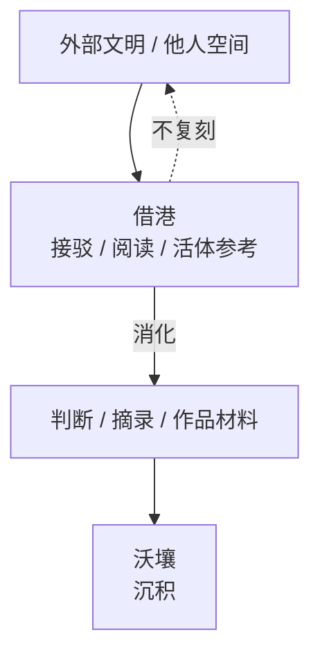
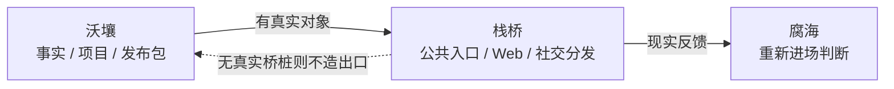
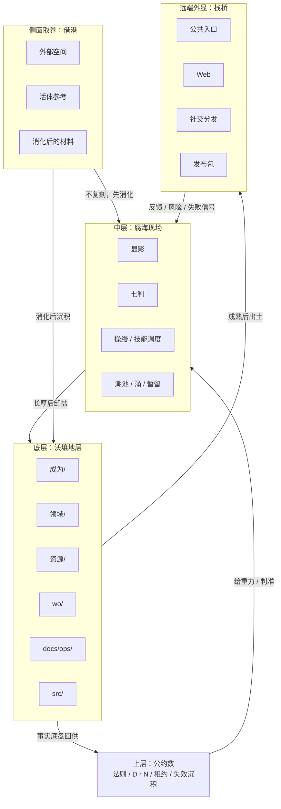

# 沃壤 v0.1 · 空间呈现雕工札记

> 本札记承接 PR #100「沃壤 v0.1 · 全空间快照」。它不是替代快照正图，而是记录一次把整套空间从“目录 / 流程图”继续雕成“空间受力 / 观看路径 / 剖面”的尝试。

## 0. 放置理由

#100 的快照已经回答：沃壤有哪些层、如何相互校验、当前有哪些未竟事项。

这份补充札记回答另一个问题：

```text
当我们说“整个空间”时，它不是一张目录，而是一套有内外、厚薄、流向、承重与出口的空间。
```

所以这里不重画星盘，不替代 Notion 里的「星盘 · 工作空间拓扑总览」，只保存一次呈现雕工的试样：如何把同一个空间看成水流、剖面和观看路径。

## 1. 核心句

星盘当前的核心句是：

> 公约数立法，腐海进场，借港取养，沃壤沉积，栈桥外显。

这句话不是目录句，而是一条空间动力学：规则从哪里来，现场在哪里发生，外部养分从哪里接，事实沉到哪里，最后从哪里出去。

也可以压成另一句：

> 星盘不是地图，是水流图。

## 2. 五域三流

五域：

| 空间 | 不是 | 更像 |
|---|---|---|
| 公约数 | 不是知识库 | 法则层 / 重力场 |
| 腐海 | 不是总目录 | 现场生态 / 发生地 |
| 借港 | 不是收藏夹 | 异域养分接口 |
| 沃壤 | 不是备份仓 | 事实沉积地层 |
| 栈桥 | 不是展示柜 | 对外折射 / 出口 |

三流：

1. **内流**：公约数给规则，腐海负责现场，沃壤承接沉积。
2. **外流入**：借港把外部文明接进来，但不复制、不吞并。
3. **外流出**：栈桥让成熟地层外显，再把反馈带回现场。

## 3. 空间受力图

这张图和 #100 的全空间流图不同。

- #100 正图负责“全量拍照”：入口、工具、证实、行动、外显、守法都在。
- 本图负责“空间受力”：东西如何在五域之间流动。



## 4. 观看路径

第一次进入这套空间的人，不应该先被所有名词淹没。

观看路径应先找重力，再找现场，再找事实，最后再看外部入口与出口。



入口次序：

1. **公约数**：这里为什么不是普通知识库。
2. **腐海**：现场如何运行。
3. **沃壤**：事实最终沉在哪里。
4. **借港 / 栈桥**：外部如何进来，成熟之物如何出去。

## 5. 三条断裂带

### 5.1 Notion 现场 vs Git 地层

Notion 是现场介质，Git / 沃壤是事实底盘。



雕工重点：不要把 Notion 画成资料库，也不要把 Git 画成冷仓库。它们是两种介质：一个负责现场，一个负责地层。

### 5.2 内部法则 vs 外部养分

借港不是收藏夹，而是取养口。



雕工重点：借港不是复制世界，而是让外部文明经过消化后再沉积。

### 5.3 沉积地层 vs 外显出口

栈桥不是“为了展示所以造展厅”。它是等真实桥桩出现才接。



雕工重点：外显不是装饰，是事实地层成熟后的折射。

## 6. 地形剖面图

如果把整个空间从平面图转成剖面图，它更像这样：



这张剖面图补足了平面流图的一个缺口：它显出“上层 / 中层 / 底层 / 侧面 / 远端”的空间感。

## 7. 呈现雕工自审

这次试样的价值：

- 把“空间有哪些”转成“东西如何流”。
- 把“入口列表”转成“观看路径”。
- 把“总图”拆出三条断裂带。
- 把平面图继续转成剖面图。

仍不足：

1. **还偏系统图**：空间感比目录强，但还缺真正的高低、厚薄、密度、流速。
2. **腐海七判被压扁**：若继续做，应给七判单独做一个现场机制图。
3. **栈桥仍很薄**：这符合现实，因为真实桥桩尚少，但视觉上出口弱。
4. **源稿层未显影**：旧全景源稿、历史证据、悬置问题仍被折叠。

## 8. 对 #100 的补充意义

#100 是快照：它证明沃壤 v0.1 已经有入口、有现场、有地层、有身体、有外显、有守法层，也有未竟事项。

本札记是观看法：它尝试证明同一套空间可以被进一步雕成：

```text
水流图：看动线。
剖面图：看层次。
断裂带：看介质差异。
观看路径：看进入顺序。
```

这就是“呈现雕工”在 #100 里的第一块样本。

## 9. 下一步接法

如果继续做，不急着改星盘正图。

下一步可以选一条细部继续雕：

1. **七判现场机制图**：把腐海内部的显影、承重、易舟、下篙、倒缆、操缦、卸盐画成现场工艺。
2. **Notion / Git 双介质图**：专门解释为什么活现场与沉地层不能互相替代。
3. **栈桥桥桩图**：等真实外显对象更多，再补出口侧的结构。
4. **呈现雕工小准则**：把本次试样抽成技能候选，不急着授柄。
