# 沃壤 v0.1 · 全空间快照

又名：**第一块可携带土**。

> 第 100 次不是发布一个完成品，而是给一个已经能重新进入的活系统拍照。Notion 留下现场，GitHub 留下地层，本地留下身体；未完成之物也一起入镜，因为真实的快照不擦掉脚印。

## 0. 快照锚点

- 快照名：`沃壤 v0.1 · 全空间快照`
- 纪念名：`第一块可携带土`
- GitHub 基线：`main @ 17dff744964688afa39e2c5fc544aedfd042f432`
- 快照日期：`2026-05-31`（北京时间跨入 2026-06-01 时起草）
- 当前形态：snapshot PR；不是 GitHub Release，也不是运行时代码变更。
- 追记：2026-06-01，#102、#104、#106 已在快照之后合入；本页仍保留 #100 成立时的照片，但在第 6 节追加当前事实。

这一刀只做一件事：把 Notion、GitHub、local、外显与未竟事项放进同一张可回看的照片里。

## 1. 总判

到 #100，沃壤已经不是单点工具，也不是单页 Notion。它至少有了四层可互相校验的身体：

1. **Notion / 腐海**：活现场，负责显影、分解、调度、暂留、七判与转场。
2. **GitHub / 沃壤**：沉地层，负责事实底盘、版本化迁徙、机制沉积与候选 PR。
3. **MacBook / 本地环境**：物理身体，负责运行、编译、测试、文件系统手感。
4. **栈桥 / 外显层**：出土与回声，负责公共入口、Web、社交、发布包与外部反馈。

最重要的秩序已经形成：

> Notion 是活现场；GitHub 是沉地层；本地是身体；外显是出土口。

## 2. 全空间流图

这张图是 #100 的总空间图：世界如何进入，如何在腐海显影，如何被证实，如何沉到沃壤，如何碰到行动，如何出土，再如何回声。

```mermaid
flowchart TD
%% =====================
%% 世界来物
%% =====================
subgraph WORLD["世界来物"]
W1["得到知识资产<br>课程 / 听书 / 电子书 / 老师 / 内容方法论"]
W2["长影音<br>B站 / YouTube / 播客 / 课程 / 会议"]
W3["外部网页与活体空间<br>网页 / GitHub / Reddit / 别人的 Notion"]
W4["外界责任<br>邮件 / 通知 / 关系请求 / 待回复事项"]
W5["谷的当前语流<br>问题 / 感受 / 判断 / 灵感 / 对话"]
W6["项目与代码现实<br>文件 / PR / commit / 报错 / 运行结果"]
W7["素材与媒介<br>图片 / 设计资源 / Eagle / NAS / 重文件"]
end

%% =====================
%% 入口器官
%% =====================
subgraph ENTRY["入口器官：世界从哪里进来"]
DEDAO["学｜得到大脑<br>得到资产 + 谷的学习史<br>按当前问题复用"]
BIBI["取｜BibiGPT<br>长影音结构化萃取"]
BROWSE["取｜ai-browse<br>外界页面取样"]
JIEGANG["取｜借港<br>外部 Notion 活体空间入口"]
MAIL["递｜Mail / 朝菌<br>外界责任降雾"]
DIALOG["显｜克谷对话<br>谷带重力，克出形"]
MEDIA["取｜素材库<br>Eagle / NAS / 影音元数据"]
end

%% =====================
%% 腐海现场
%% =====================
subgraph FUHAI_ZONE["显影调度层：Notion / 腐海"]
FUHAI["腐海现场<br>显影 / 分解 / 净化 / 暂留 / 观察"]
SEVEN["七判<br>显影 / 承重 / 易舟 / 下篙 / 倒缆 / 操缦 / 卸盐"]
JIKUO["机括<br>场内手 / 寻址手 / 施工手 / 外线手 / 回声手 / 工位手"]
DAOLAN["倒缆<br>工具通道与操作红线"]
SKILLS["十技 / 技能页<br>研究 / 捕捉 / 审计 / 结撰 / 编校 / 赋形"]
end

%% =====================
%% 证实层
%% =====================
subgraph VERIFY["证实层：还原事实，不抢意义"]
NLM["证｜NotebookLM<br>source pack 问答 / 引用 / 定位"]
SEARCH["证｜Search / Web / Helpdocs<br>外部事实 / 产品文档 / 寻址"]
GITREAD["证｜GitHub 读取<br>文件 / issue / PR / commit / 历史"]
LOCALCHECK["证｜MacBook 本地验证<br>运行 / 编译 / 测试 / 环境手感"]
ECHO["证｜回声手<br>会议 / 线程 / 评论 / 访问痕迹"]
end

%% =====================
%% 沃壤主源
%% =====================
subgraph WORANG["沉积主源：GitHub / 沃壤"]
ROOT["沃壤<br>事实底盘 / 版本化地层 / 迁徙凭证"]
BECOME["成为/<br>项目 / 沉积 / 色散 / 手心 / 情绪 / 身体"]
DOMAIN["领域/<br>长期能力域 / 责任区 / 作品域"]
RESOURCE["资源/<br>外部材料 / 学习材料 / 引用 / 补给"]
WOCLI["wo/<br>本地动作接口 / 样本 / 机制 / source pack"]
DOCSOPS["docs/ops/<br>发布 / 展示 / Web / 分发 / 操作文档"]
SRC["src/<br>wo CLI 实现 / Rust 代码"]
end

%% =====================
%% 行动层
%% =====================
subgraph ACTION["行动层：让判断碰到现实"]
WO["行｜wo CLI<br>sense / tend / spark / make / weigh"]
CODEAI["行｜Claude Code / Codex / 本地 Agent<br>代码架构 / 文件修改 / 测试"]
MAC["行｜MacBook / 本地环境<br>文件系统 / shell / 截图 / 物理执行"]
PR["行｜GitHub PR<br>候选沉积 / review / merge 前守门"]
end

%% =====================
%% 外显层
%% =====================
subgraph OUT["外显层：出土与回声"]
ZHANQIAO["外｜栈桥<br>公共入口 / Web / 社交 / 发布包路标"]
WEB["外｜Web / 个人页面<br>可控门面 / 静态数据 / 工作室展示"]
SOCIAL["外｜Telegram / 小红书 / 公众号<br>分发 / 试验 / 外部反馈"]
PACKAGE["外｜发布包<br>出土前托盘 / 平台草稿"]
FEEDBACK["回声<br>评论 / 访问 / 外部引用 / 失败信号"]
end

%% =====================
%% 守法层
%% =====================
subgraph LAW["守法层：防漂移与承重"]
GY["公约数<br>运行协议 / L1 / L2 / 隐喻受力面"]
DNR["D r N<br>动作尺度 / 承重 / 降级"]
BOUND["边界<br>授权 / 关系动作 / 公开 / 权限 / 花钱 / 合并"]
AUDIT["研究 / 审计 / 复核<br>SIFT / CRAAP / 双维标记 / 防漂移"]
end

%% =====================
%% 世界来物 → 入口
%% =====================
W1 --> DEDAO
W2 --> BIBI
W3 --> BROWSE
W3 --> JIEGANG
W4 --> MAIL
W5 --> DIALOG
W6 --> GITREAD
W6 --> LOCALCHECK
W7 --> MEDIA

%% =====================
%% 入口 → 腐海显影
%% =====================
DEDAO --> DIALOG
DEDAO --> FUHAI

BIBI --> FUHAI
BROWSE --> FUHAI
JIEGANG --> FUHAI
MEDIA --> FUHAI

MAIL --> DAOLAN
DAOLAN --> FUHAI

DIALOG --> FUHAI

%% =====================
%% 腐海内部调度
%% =====================
FUHAI --> SEVEN
SEVEN --> JIKUO
SEVEN --> DAOLAN
SEVEN --> SKILLS

JIKUO --> FUHAI
DAOLAN --> FUHAI
SKILLS --> FUHAI

%% =====================
%% 腐海 → 证实层
%% =====================
SEVEN -->|"缺事实：下篙"| SEARCH
SEVEN -->|"需源内还原"| NLM
SEVEN -->|"查地层事实"| GITREAD
SEVEN -->|"查发生痕迹"| ECHO
SEVEN -->|"需运行证明"| LOCALCHECK

SEARCH --> FUHAI
NLM --> FUHAI
GITREAD --> FUHAI
ECHO --> FUHAI
LOCALCHECK --> FUHAI

%% =====================
%% 腐海 → 沃壤：卸盐
%% =====================
SEVEN -->|"卸盐：长厚成事实 / 机制 / 作品 / 资源"| ROOT

ROOT --> BECOME
ROOT --> DOMAIN
ROOT --> RESOURCE
ROOT --> WOCLI
ROOT --> DOCSOPS
ROOT --> SRC

FUHAI -->|"项目事实 / 过程沉积"| BECOME
FUHAI -->|"长期能力 / 作品脉络"| DOMAIN
FUHAI -->|"外部材料已消化"| RESOURCE
FUHAI -->|"机制 / 样本 / source pack"| WOCLI
FUHAI -->|"发布 / 展示 / 分发机制"| DOCSOPS

%% =====================
%% 沃壤 → 证实 / 行动
%% =====================
BECOME --> WO
WOCLI --> WO
WOCLI --> NLM
DOMAIN --> NLM
RESOURCE --> NLM

SRC --> CODEAI
DOCSOPS --> CODEAI
WO --> MAC
CODEAI --> MAC
MAC --> LOCALCHECK

CODEAI --> PR
PR --> GITREAD
PR --> ROOT

%% =====================
%% 沃壤 / 腐海 → 外显
%% =====================
DOCSOPS --> ZHANQIAO
FUHAI -->|"仍是活体展示入口"| ZHANQIAO

ZHANQIAO --> WEB
ZHANQIAO --> SOCIAL
ZHANQIAO --> PACKAGE
PACKAGE --> SOCIAL

WEB --> FEEDBACK
SOCIAL --> FEEDBACK
FEEDBACK --> FUHAI
FEEDBACK --> DOCSOPS

%% =====================
%% 主源回流
%% =====================
ROOT -->|"下一轮事实底盘"| DIALOG
FUHAI -->|"仍在发热，继续共同治理"| DIALOG

%% =====================
%% 守法层约束
%% =====================
GY -.-> DIALOG
GY -.-> FUHAI
GY -.-> SEVEN

DNR -.-> DIALOG
DNR -.-> SEVEN

BOUND -.-> DAOLAN
BOUND -.-> MAIL
BOUND -.-> PR
BOUND -.-> SOCIAL
BOUND -.-> ZHANQIAO

AUDIT -.-> SEARCH
AUDIT -.-> NLM
AUDIT -.-> GITREAD
AUDIT -.-> FUHAI
AUDIT -.-> ROOT
```

## 3. Notion 快照：活现场已经成形

#100 之前，Notion 的关键变化不是“内容更多了”，而是“每个位置终于有了居留权”。

### 3.1 腐海：从入口协议变成现场生态

腐海的年轮很清楚：

1. `沃壤 · 流水线角色与元认知协议`：早期还是角色、流水线、元认知协议。
2. `温棚 · 进场协议与角色编组`：开始成为进场、交接、角色编组的温室。
3. `腐海 · 古文明生态系统`：七门、腐海公理、AI 四位出现。
4. 当前腐海：全球拓扑退给星盘，自己保留现场、索网、七判、AI 六位指针。

这说明腐海不是越长越厚，而是逐渐学会退位：不再抢总地图，不再复刻 GitHub，只保留现场的显影与调度。

### 3.2 星盘：接管总拓扑

星盘从 `Notion 空间总览 · 入口草案` 长成 `星盘 · 工作空间拓扑总览`。

它的意义是：腐海不再承担所有入口压力。第一跳、居留权、总拓扑由星盘负责；腐海回到现场处理。

### 3.3 公约数：三层分化

公约数从“AI 运行说明草案”分化成：

- L1：物理学讲义，说明为什么。
- L2：隐喻受力面，说明怎样承重、怎样租约。
- 上场底谱：说明每一轮怎么上场。

再加上摩擦沉积床，失败不再靠口头道歉解决，而是能被记录、归类、复核。

### 3.4 潮池：候选规则有暂留地

潮池从 `空间分流观察台` 长成 `潮池 · 施工证据与候选规则`。

它的意义是：不是所有观察都立刻升格为 L1 / L2 / 底谱，也不是所有东西都丢进 GitHub。候选规则先有施工台，等证据足够再转场。

## 4. GitHub 快照：沃壤已经有沉地层

当前 `README.md` 已经把大分工说清楚：Notion 是腐海，GitHub / worang 是沃壤。

当前主要地层：

- `成为/`：项目、沉积、色散、手心、情绪、身体。
- `领域/`：长期能力域、责任区、作品域。
- `资源/`：外部材料、学习材料、引用、补给。
- `wo/`：本地动作接口、机制、样本、source pack。
- `docs/ops/`：发布、展示、Web、分发、操作文档。
- `src/`：wo CLI 的 Rust 实现。

### 4.1 已有标签，无 GitHub Release

已有标签：

- `wo-entry-v0`
- `wo-ask-map-v0`
- `wo-make-hand-v0`
- `wo-roadmap-v0`

但当前没有 GitHub Release。#100 因此不是“正式 Release 发布”，而是一次 milestone snapshot：先把可携带土装起来，再决定未来是否切正式 release。

### 4.2 PR 年轮

近阶段关键年轮：

- PR #70–#78：Notion 厚材料外运 GitHub，形成“活现场 / 沉地层”的真实操作。
- PR #83–#86：AI 本体 GitHub 化，`wo/ai.md` 成为操作投影，腐海只留入口与指针。
- PR #88–#96：空间审计封板，把栈桥、腐海七判、操缦、借港、涌/潮池、本地手感位、AI 位置图、成为/项目、公约数三层逐一沉积。
- PR #102：CSV canonicalization，把成对 ordinary `.csv` / `*_all.csv` 合并为 canonical ordinary `.csv`，并让 active runtime 与 docs 不再依赖 paired `_all.csv` 假设。
- PR #104：NLM runtime boundary，把终端桥明确排除在当前路线外，确立 GitHub MCP / GitHub Actions / Cloudflare / VPS 的轻重顺序。
- PR #106：branch archive index，为远端分支清淤提供 pre-delete ledger。

这些不是散 PR，而是把空间从“靠记忆运行”推到“靠地层可回看”。

## 5. 本地快照：身体能跑，但现场不干净

用户提供的本地证据：

- 路径：`/Users/jiajia/Library/Mobile Documents/com~apple~CloudDocs/Obsidian/kb/沃壤`
- 本地分支：`refactor/prioritize-knowledge-dirs`
- `cargo test`：`58 passed; 0 failed`
- `cargo run -- sense`：成功
- `cargo run -- make`：成功
- `cargo run -- ask`：成功

但本地同时是 dirty working tree，并且不在 `main`。所以它证明的是：

> 沃壤本地身体还活着，而且能跑；但这不是 main 的洁净验证，也不是所有后续 PR 的直接验证。

这正是快照应该记录的状态：活系统不是无尘室。

## 6. 当前未竟事项

#100 不擦掉未完成之物。这里分成两层：**快照起草时的未竟事项**与**2026-06-01 追记事实**。

### 6.1 快照起草时的未竟事项

- PR #97：`fix(sense): layer emotion csv for issue 80`
  - 当时状态：open / unmerged。
  - 性质：Issue #80 的候选实现；需要后续收 PR。
- PR #99：`docs: record csv layer policy`
  - 当时状态：open / unmerged。
  - 性质：`*_all.csv` / 普通 csv 策略第一刀；文档规则层，未动运行时代码。
- Issue #81：扩展 NLM source packs 并验证脚本可用性。
- Issue #82：增强 trace / 色散查询编辑能力。
- Issue #98：统一 `*_all.csv` / 普通 csv 读取与写入策略。
- Issue #80 已关闭为 completed，但候选实现 PR #97 尚未合并，因此“议题收束”和“代码入主干”仍分开记录。

### 6.2 2026-06-01 追记事实

- PR #97 已关闭且未合并；不再作为当前合流对象。
- PR #99 已关闭且未合并；其策略语义已被后续 canonical CSV 路线覆盖。
- PR #102 已合并：canonicalize CSV sources。
  - ordinary `.csv` 已成为 canonical source。
  - 成对 `*_all.csv` 已迁入 canonical ordinary CSV 并删除 paired 文件。
  - `sense` / `make` / `trace` 已改读 canonical CSV。
- PR #104 已合并：NLM runtime boundary。
  - 终端桥明确不是当前路径。
  - GitHub MCP 是克当前能用的远手。
  - GitHub Actions / Cloudflare 在 VPS 之前。
- PR #106 已合并：branch archive index。
  - 分支清理已有 pre-delete ledger。
- 当前仍 open：
  - PR #100：本 snapshot。
  - PR #103：distribution safety gate dry-run verification；需拆分或重定 base 后再合。
  - PR #105：GetNote mirror v0；需单独审。
- 当前仍 open 的 issue：
  - #81 NLM source packs / sanity check。
  - #82 trace / 色散查询编辑能力。
  - #98 CSV 策略 issue；应根据 #102 判断是否补充说明后关闭或重定范围。

## 7. 八个相变点

#100 的历史不按流水账写，而按相变写。

| 序 | 相变 | 意义 |
|---:|---|---|
| 1 | 温棚 / 沃壤入口 → 腐海现场生态 | Notion 从进场协议长成现场生态。 |
| 2 | 腐海退位，星盘接管总拓扑 | 腐海不再抢总图，星盘负责第一跳与居留权。 |
| 3 | 公约数三层分化 | L1 / L2 / 上场底谱分工成形。 |
| 4 | 候选规则有暂留地 | 潮池成为施工证据与候选规则池。 |
| 5 | 本地身体长成 | `wo` CLI 从入口命令长出 sense / ask / make 等动作接口。 |
| 6 | Notion 厚材料外运 GitHub | 活现场与沉地层开始分工。 |
| 7 | AI 本体 GitHub 化 | `wo/ai.md` 承接操作投影，Notion 保入口与调度。 |
| 8 | 空间审计封板 | #88–#96 把主要空间边界逐一验收。 |

一句话说：

> 页面如何变名、变职、变薄；GitHub 如何从可执行身体长成沉积地层；Notion 与 GitHub 如何终于不互相抢母本。

## 8. #100 明确不做什么

本 PR 不做：

- 不创建正式 GitHub Release。
- 不改运行时代码。
- 不清理本地 dirty working tree。
- 不做完整 Notion 备份。
- 不把活现场强行冻成 GitHub 文件。
- 不把 #102 之后已经废弃的 paired `_all.csv` 路线恢复为当前运行假设。
- 不恢复终端桥。
- 不处理 #103 / #105 的合流判断。

#100 是拍照，不是扫地；是立碑，不是封棺。

## 9. 未来再致敬的方法

以后每一个值得纪念的节点，都可以回问四个问题：

1. 当时的 Notion 活现场在哪里？
2. 当时的 GitHub 沉地层在哪里？
3. 当时本地身体能跑什么？
4. 当时有哪些未竟之物被诚实留下？

如果四个问题都有答案，就说明那一次不是幻觉，而是一块可以被后面再次拿起的土。

## 10. 结语

沃壤 v0.1 不是“终于完成”。

它只是第一次足够清楚地证明：这个空间已经有入口、有现场、有地层、有身体、有外显、有守法层，也有未竟事项。

所以 #100 的纪念不是因为圆满，而是因为它已经能被重新进入。
