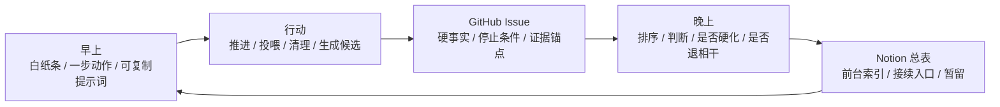
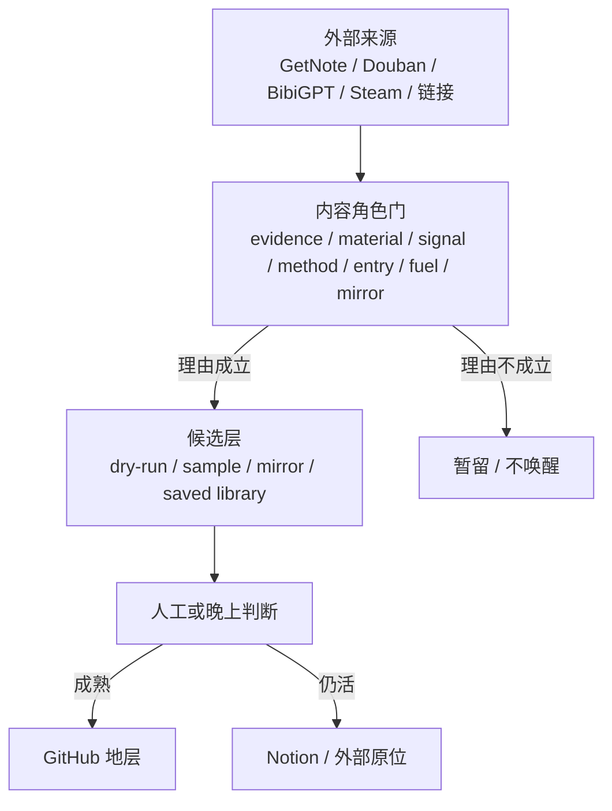

# 沃壤 v0.2 · 接续与地层雕工札记

> 本札记承接 `沃壤 v0.2 · 多源运行地层快照`。它不是替代快照正图，而是记录 #100 之后空间呈现的关键变化：这次不再只看“空间如何存在”，而要看“空间如何接续”。

## 0. 放置理由

#100 的雕工重点是：把沃壤从目录雕成空间，说明水流、剖面、断裂带与观看路径。

v0.2 的雕工重点不同：

```text
系统已经有空间感以后，真正的问题变成：明天早上从哪里继续，晚上在哪里判断，事实沉在哪里，事故怎样不白发生。
```

因此本札记不重画 #100 的全空间图，而记录四种新的观看法：

1. 接续图：早上 / 晚上 / 硬层如何分工。
2. 多源图：外部资源如何先进入候选与守门，而不是直接沉库。
3. 事故表：错误 PR、权限失败、重复 issue 如何变成地层事实。
4. 雷达图：Notion 前台、GitHub Issue、未来 Projects 怎样各守其位。

## 1. 核心句

v0.2 的核心句是：

> Notion 给我下一步；GitHub 记住为什么；Projects 以后只负责看见，不负责替事实存在。

再压短一点：

> 接续不是看全景，是拿到下一步。

## 图例（线义统一 · 本札记各图通用）

> 与「v0.2 全空间运行流图」「v0.2 全景合体图」「空间飞轮图」共用一套线义：
> - 实线 `-->`：主流向 / 主沉积链。
> - 粗实线 `==>`：跨层 / 跨空间主沉积链。
> - 虚线 `-.->`：支撑 / 反向拉动 / 漏出 / 仍薄未接线。
> - 实线框＝已建（在转）；虚线框＝待建 / 半轮 / 很薄；💤＝休眠（设计完整、暂未启用、即醒）；⚠＝漏点。
> 本札记 §2 早晚双层、§4 多源守门两图均为**实线主流向闭环**（已建 · 在转）；事故（§5）为**表**不是图。

## 2. 早晚双层



这张图修正一个误区：项目管理不是把所有东西都展示出来，而是让不同时间只看该看的东西。

- 早上：只要下一步。
- 晚上：才做判断。
- Notion：给前台入口。
- GitHub：给硬事实。
- Projects：以后给雷达视图。

## 3. 前台 / 后台 / 硬层

| 层 | 介质 | 负责 | 不负责 |
|---|---|---|---|
| 前台 | Notion 驾驶舱页面 | 早上看到什么、复制什么、从哪里继续 | 存全部事实 |
| 后台 | Notion 总表 | 全部项目线的暂留、索引、接续入口 | 变成漂亮负担 |
| 硬层 | GitHub Issues / PRs / docs | 事实、证据、事故、停止条件、版本化 | 替谷做价值裁决 |
| 视图层 | GitHub Projects | 看状态、类型、是否等待谷 | 作为事实本体 |

## 4. 多源资源的守门法

v0.2 的资源雕工不再问“能不能同步”，而问：

```text
它此刻为什么值得被唤醒？
```



关键不是把外部东西收进来，而是防止它们因为“技术上能同步”就污染地层。

## 5. 事故不是噪音

v0.2 比 #100 更能看见事故。

| 事故 | 错在哪里 | 变成什么规则 |
|---|---|---|
| #171 | 把 BibiGPT 正常生成物当手工迁移任务 | saved library 是第一入口；GitHub 只沉规则和必要材料 |
| #173 | 把身体场压成 daily template | 身体线先要 panorama / real-use sample，不急着格式化 |
| workflow 403 | 把自动化设计误当自动化已成立 | 权限失败本身是地层事实 |
| GitHub Actions 不能自动开 PR | 运行能力不等于治理能力 | 候选可生成，合流仍需守门 |
| Projects 过早冲动 | 把视图当事实本体 | Issue 先稳定，Projects 后成为雷达 |
| #200 编号事故 | 把 hard-anchor issue 创建动作撞到纪念编号 | #202 承担真实快照；编号事故留作地层事实 |

## 6. v0.2 的观看路径

第一次看 v0.2，不应该先读所有 PR。

更好的路径是：

1. 先看快照总判：系统从“可重新进入”变成“可多源接续”。
2. 再看八个相变点：知道 #100 后到底变了什么。
3. 再看事故表：知道哪些方向不能继续。
4. 再看接续行动表：知道哪些项目线已经进 GitHub Issue。
5. 再看未竟事项：知道当前真正要接哪里。
6. 最后才回到具体 PR / issue / docs。

## 7. 对 #100 的补充意义

#100 是第一块土：证明空间已经有入口、有现场、有地层、有身体、有外显、有守法层。

v0.2 是第二块土：证明空间已经开始有：

```text
多源入口：外部来源不是散的。
内容守门：资源不是因为存在就更新。
运行边界：自动化不是说有就有。
事故地层：错路会成为规则。
接续入口：下一步不靠记忆重启。
```

所以 v0.2 的雕工不是“再画一个更复杂的空间”，而是把空间雕成能被明天接住的形状。

## 8. 下一步接法

不急着把本札记继续扩成系统。

更该接的顺序是：

1. 让 #191–#197 这些 hard anchors 先跑一轮。
2. 用这些 issue 反向验证 Notion 驾驶舱是否真的轻。
3. 再决定 GitHub Projects 的最小视图字段。
4. 最后才考虑是否把 v0.2 的快照方法固化成未来 #300 / v0.3 的模板。

## 9. 最小 Projects 视图原则

如果之后建立 GitHub Projects，它只应该显示极少字段：

- `Status`：现在可推进 / 等谷判断 / 卡住 / 暂留 / 完成。
- `Area`：PR 快照 / WQB / 资源 / AI 共台 / Agent / 链接健康 / Notion 外运。
- `Layer`：早上执行 / 晚上判断 / 总记录 / 暂留。
- `Waiting on Gu`：是 / 否。
- `Next step`：一句短动作。

Projects 的责任是看见，不是写史；写史仍在 issues、PRs、docs 和 Notion 活现场里。
