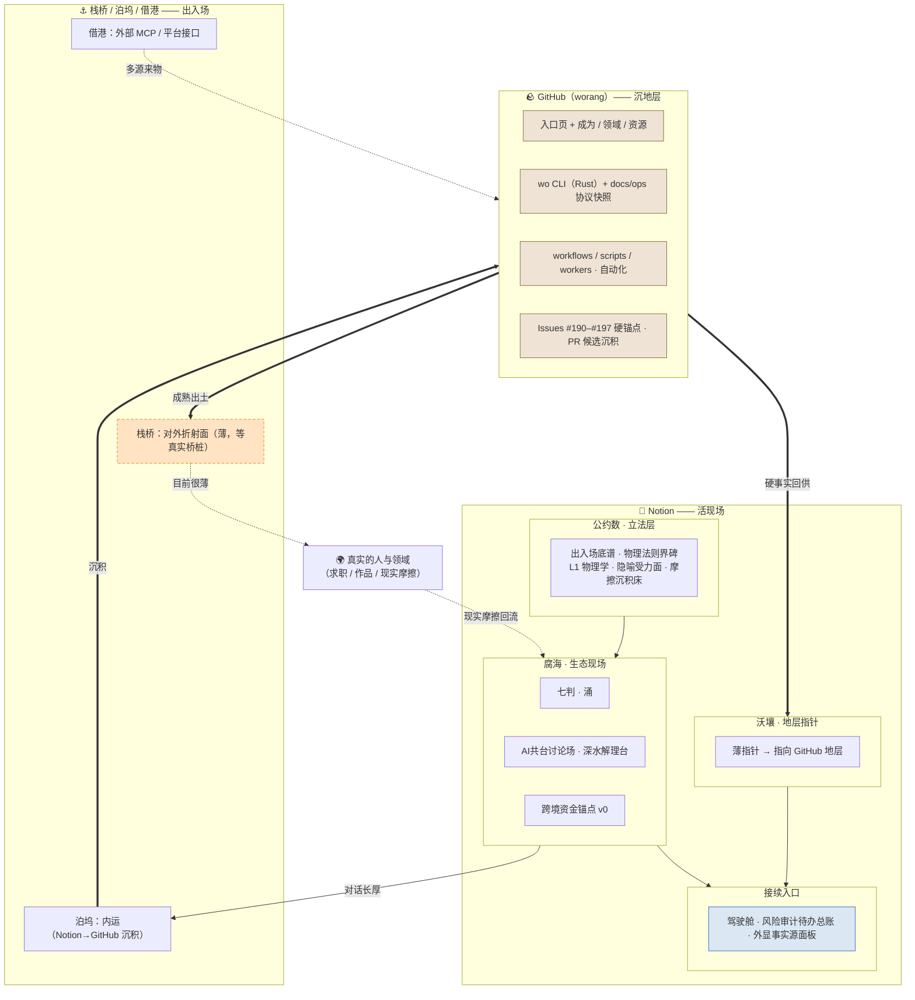

# 沃壤 v0.2 · 全景合体图（Notion + GitHub 同框，2026-06-13）

> 本图是 v0.2 快照的**全景伴随图**，与主快照里的「v0.2 全空间运行流图」同尺度、互为参照：把 Notion 活现场与 GitHub 沉地层放进同一张照片，看清两边怎么经由栈桥 / 泊坞 / 借港出入场。
>
> - 镜头尺标：全景 ＝ Notion + GitHub + 一切（本图所在层级）
> - 来源：2026-06-13 Notion 对话回填。对话中的原图已滚出可见窗口，本图按已验证拓扑（星盘 / 腐海 / 沃壤）与 GitHub 地层重建。

## 全景流图

> 图例（线义统一 · 全图谱通用 ＋ 色温双通道，依出入场底谱）：
> - 实线 `-->`：主流向 / 内部沉积链（东西真往这走）。
> - 粗实线 `==>`：跨层主沉积链（沉积 · 硬事实回供 · 成熟出土）。
> - 虚线 `-.->`：支撑 / 反向拉动 / 漏出 / 仍薄未接线。
> - 实线框节点：已建（在转）。
> - 虚线框节点：待建 / 半轮 / 很薄（设计在、未闭合，如栈桥 BR3）。
> - 💤：休眠段（设计完整、暂未启用、即醒，依「休眠不摘牌」仍画）。
> - ⚠：漏点（链路断在这就变负复利）。
> - 色温：🟤 棕＝GitHub 沉地层（旧事实 / 已沉积）；🔵 蓝＝判断 / 仪表（驾驶舱 · 外显事实源）；🟠 橙＝待建 / 注意（栈桥对外折射面薄，等真实桥桩）；⚪ 无色＝Notion 活现场 / 中性。颜色与文字双通道，同一张图同色单义。

## 一句话读法

里头（公约数立法 → 腐海现场 → 沃壤地层 → GitHub 沉积）已经是闭环、互证、稳的；整张图唯一薄的一段是 **栈桥（对外折射面）**——东西沉得很厚，但还没真正流出去被真实的人用到。全景看下来，下一程不在纵深，在边缘：朝外走。
