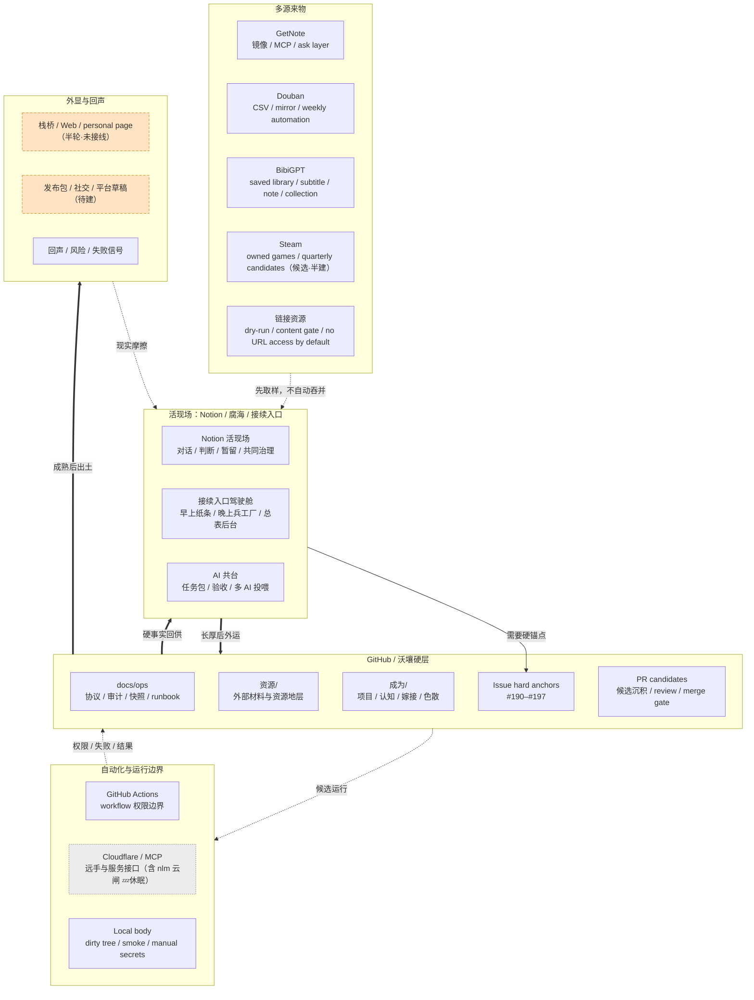

# 沃壤 v0.2 · 多源运行地层快照

又名：**第二块可携带土**。

> 第 200 次附近不该只是继续堆 PR，而该给 #100 之后已经确定成形的东西再拍一次照：Notion 仍是活现场，GitHub 已经不只是沉地层，而开始承接多源同步、资源守门、链接健康、自动化边界与接续驾驶舱。事故也一起入镜，因为 v0.2 的重点不是更干净，而是更能接续。

## 0. 快照锚点

- 快照名：`沃壤 v0.2 · 多源运行地层快照`
- 纪念名：`第二块可携带土`
- GitHub 基线：`main @ 29e3d24f057b50c5ff972653a3e098e332c69e25`
- 快照日期：`2026-06-10`（北京时间）
- 当前形态：snapshot PR；不是 GitHub Release，也不是运行时代码变更。
- 实际 PR：#202 `release: cut wo v0.2 space snapshot`。
- 编号说明：#200 这个编号已被一次 cockpit hard-anchor 过程中的 issue 误占；因此 #202 承担真正的“#200 式快照”动作。
- 承接对象：#100 之后至 #189 之间已发生的主线变化；同时记录 #190–#197 作为接续入口驾驶舱的硬锚点。

这一步只做一件事：把 #100 之后已经长出来的多源运行层、资源守门层、Notion 外运层、链接健康层、Agent 边界层和项目接续入口，放进同一张可回看的照片里。

## 1. 总判

到 v0.2，沃壤已经不只是“能被重新进入”的空间，而是开始具备一套更硬的运行秩序：

1. **多源同步正在成形**：GetNote、Douban、BibiGPT、Steam、链接索引等外部来源不再只是散资源，而开始有各自的入口、镜像、守门与不做边界。
2. **Notion / GitHub 分工更清楚**：Notion 保持活现场、共同治理、前台驾驶舱；GitHub 承接版本化事实、快照、运行协议、事故记录与硬锚点。
3. **资源更新不再只看技术可行性**：资源是否更新，必须有内容角色：证据、材料、信号、方法、入口、燃料或镜像。
4. **自动化边界开始被真正试探**：GitHub Actions、MCP、Cloudflare Worker、NLM runner、Steam quarterly sync、Notion daily sedimentation 都出现了，但每条都留下权限、密钥、workflow、候选层或人工守门边界。
5. **项目接续问题浮出水面**：真正困扰谷的不是“有没有项目管理表”，而是早上如何不被全景压住、晚上如何把判断放回该放的位置、所有线如何有硬锚点。
6. **PR / Issue / Notion 三种介质开始分工**：PR 记录候选沉积与合流；Issue 记录硬锚点与下一步；Notion 记录前台接续和活现场。

一句话：

> #100 证明沃壤能被重新进入；v0.2 证明沃壤开始能被多源接续、被事故校正、被硬锚点牵住。

## 2. v0.2 全空间运行流图（功能层 · 多源流向）

> 本图与全景伴随图「v0.2 全景合体图」互为参照：全景合体图看 Notion / GitHub 两块土怎么经栈桥同框出入场；本图看系统**功能层**之间（活现场 / 多源来物 / 硬层 / 自动化 / 外显）东西怎么流。

> 图例（线义统一 · 全图谱通用，与全景合体图 / 雕工札记各图 / 空间飞轮图共用一套）：
> - 实线 `-->`：主流向（如活现场→硬锚点）。
> - 粗实线 `==>`：主沉积链（外运 · 硬事实回供 · 成熟出土，东西真正长厚的那条主轴）。
> - 虚线 `-.->`：来物取样 / 候选试探 / 反馈 / 现实摩擦回流（支撑与反向，不是主轴）。
> - 实线框节点：已建（在转）。
> - 虚线框节点：待建 / 半轮 / 很薄（如 O1 栈桥·Web 半轮未接线、O2 发布包待建）。
> - 💤 灰虚线框：休眠段（设计完整、暂未启用、即醒，如 A2 含 nlm 云闸；依「休眠不摘牌」仍画）。
> - ⚠：漏点（链路断在这就变负复利）。
> 读法：主轴是 `活现场 ==> GITHUB ==> 外显`，两侧多源与自动化以虚线供养、反馈；当前唯一明显薄段在 OUT（朝外显现还没真接线）。

## 3. 从 #100 到 v0.2 的主线变化

### 3.1 GetNote：从资料同步变成可问的镜像层

GetNote 线不只是把资料搬进仓库，而是逐渐长出：

- mirror 与 MCP worker；
- observability index；
- ask layer；
- 同步、查询、运行边界与 worker 形态。

它的意义是：外部知识资产不再只是“收藏”，而是开始变成可定位、可镜像、可问、可审计的资源层。

### 3.2 Douban：从账户数据变成资源镜像试验

Douban 线从 seed / smoke / CSV import / account sync / weekly automation 逐步展开。

它的意义是：个人外部平台数据可以进入沃壤，但必须通过镜像、候选、CSV 与自动化边界，而不是直接把外部平台当主源。

### 3.3 BibiGPT：从文件迁移误解回到入口定位

BibiGPT 线经历了关键事故：#171 把正常生成物误解为需要手动迁移的 canonical summary，因此被关闭；后续 #177 只清历史重复，#181 改为入口定位协议。

这条线的结论很重要：

> BibiGPT saved library 是第一入口；GitHub 不是每期视频正常生成物的手工搬运终点。

GitHub 只沉积入口协议、去重规则、边界与确有必要的材料。

### 3.4 资源守门：从风险门变成内容角色门

#174–#180 与 #183–#189 把资源线推到一个新阶段：

- 资源更新必须说明 `content_reason`；
- link index dry-run 默认不读正文、不访问 URL、不写回资源；
- 技术动作必须解释它在内容上为什么值得唤醒；
- GitHub Actions 能生成候选，但权限与 PR 创建能力本身也是现实边界。

这说明资源治理已经从“能不能自动化”转成“为什么这条资源此刻值得被唤醒”。

### 3.5 Notion 外运：从一次迁移变成日终沉淀路径

#167 与 #169 使 Notion 外运不再只是“把 Notion 材料搬到 GitHub”：

- 无敏结构层可沉 GitHub；
- 私密、客户、财务、账号、共同治理现场留 Notion；
- 日终沉淀样例包与脚本出现；
- workflow 写入 `.github/workflows/` 遇到 403，说明自动化不是纯设计问题，也受权限边界约束。

### 3.6 根目录与链接健康：从清理变成入口守护

#161、#164、#165、#166、#170、#175、#179、#182、#184、#187、#188 形成一条根目录 / 旧链接 / Notion export UUID 清理线。

关键结论不是“根目录越干净越好”，而是：

> 不要为了清洁破坏冷启动地图；允许留在根目录的入口必须能路由到真实当前路径。

### 3.7 身体 / 声音 / 游戏：候选层比格式层更重要

身体线出现过事故：#173 Body Field Daily v0 被明确关闭，不能作为后续方向；#178 试图回到 panorama 层，#162 留下真实使用观察。

游戏 / Steam 线则停在 quarterly candidate sync：候选层可以存在，但不能把 owned / playtime / achievement 自动等同于喜欢、重要、通关或沉积。

这说明 v0.2 对“人”的处理更谨慎：先观察、候选、守门，不急着格式化。

### 3.8 接续入口驾驶舱：项目管理问题浮出硬层

当前新增的 #190–#197 不是 #100 之后自然连续 PR 的一部分，而是 v0.2 快照前夕暴露出的新需求：谷不是缺一个漂亮项目面板，而是需要一个第一人称能用的接续入口系统。

已硬化的锚点：

- #190：Notion ↔ GitHub 同步底盘；
- #191：梳理 PR / #200 快照候选；
- #192：推进 WQB / 平台状态分析；
- #193：守门资源 / 多源入库判断；
- #194：递交任务包 / AI 共台投喂；
- #195：运行 Agent / 后台自动化边界；
- #196：清理链接 / 地层健康；
- #197：外运 Notion / 现场沉淀。

它们说明：GitHub Issues 先做硬锚点，Projects 以后只做视图层。

### 3.9 任务台面：从“两块板”改成“前台索引 + 硬层锚点”

历史对话里最关键的纠偏是：不要把软和硬粗暴物理切开。工具的硬，应该保护谷的软；外壳硬，内腔软。后来进一步压成：

- Notion 页面只给白纸条，不做漂亮全景墙；
- Notion 总表先保留，因为总得有一个所有项目放的位置；
- GitHub Issue 存可版本化事实、停止条件、事故、证据锚点；
- GitHub Projects 等 issue schema 稳定以后再做雷达视图。

这条线本身就是 v0.2 的一部分，因为它解释了为什么快照之后还必须有接续入口。

## 4. 当前需要接续的行动线

这一节把“已经干过的行动”转成“接下来该继续的行动”。它们不是新项目，而是已经进入 #190–#197 硬锚点的线。

| 线 | 已有 GitHub 硬锚点 | 当前要做什么 | 不要做什么 |
|---|---|---|---|
| 梳理 PR / v0.2 快照 | #191 / PR #202 | 把 #100→#200 附近的主线、事故、未竟事项沉到快照和 craft note | 不把数字 #200 当形式崇拜 |
| WQB / 平台 | #192 | 生成当前状态、可自主推进项、晚上待判断 | 不让早上先做方向裁决 |
| 资源守门 | #193 | 统一判断 GetNote / Douban / BibiGPT / Steam / link index 的入库、暂留、不入库 | 不因能同步就同步 |
| AI 共台递交 | #194 | 把事实、禁区、验收标准打包给合适 AI | 不让外部 AI 重新问已解决问题 |
| Agent / 自动化 | #195 | 明确目标、权限、刹车线、交回格式 | 不把后台运行混成谷的早上任务 |
| 链接健康 | #196 | 找下一批可安全清理的旧链接、根目录入口、跨页改造遗留 | 不为清洁误删历史证据 |
| Notion 外运 | #197 | 判断下一批可沉 GitHub / 暂留 Notion / 需清理链接材料 | 不把所有 Notion 自动外运 |

## 5. 关键事故与纠偏

### 5.1 #171：BibiGPT normal output 不等于手动迁移任务

事故：把正常生成物当作需要长期手动迁移的 canonical summary。

纠偏：关闭 #171；#177 只清历史重复；#181 固化入口定位协议。

### 5.2 #173：Body Field Daily v0 前提错误

事故：把身体场问题压成日常格式 / pipeline / template。

纠偏：关闭 #173；后续不能基于它继续做自动化、资源或建议系统。

### 5.3 workflow / secret / check-run 权限边界

多次出现：

- `.github/workflows/*` 写入 403；
- check-runs endpoint 不可用；
- GitHub Advanced Security secret scanning 不可用；
- GitHub Actions 不能自动创建 PR；
- secrets / API key 只能通过真实 workflow 或本地验证确认。

纠偏：把权限失败记录为地层事实，而不是把设计写成“已经自动化”。

### 5.4 项目管理误差：不要把驾驶舱做成漂亮墙

事故苗头：Notion 驾驶舱一度太像完整设计稿，早上第一屏太重。

纠偏：白纸条化 / 冰山化；Notion 前台只显示最小接续；GitHub 承接硬事实；Projects 等 issue 稳定后再做视图。

### 5.5 编号事故：#200 被 issue 占用

事故：在 cockpit hard-anchor 回填时，#200 被一个 Notion 外运重复 issue 占用，导致真正的 #200 式快照 PR 无法拿到编号 #200。

纠偏：不把这个编号事故当作要抹掉的错误；#202 承担实际快照动作，#200 issue 留作事故地层与指向，不作为 Notion 外运事实源。

## 6. v0.2 已经成立的八个相变点

| 序 | 相变 | 意义 |
|---:|---|---|
| 1 | 单一空间快照 → 多源运行地层 | #100 的空间图之后，多源同步与资源守门开始真实运行。 |
| 2 | 资源存在 → 内容角色门 | 资源更新必须说明为什么此刻值得被唤醒。 |
| 3 | BibiGPT 文件迁移 → saved library 入口定位 | 正常生成物留在 BibiGPT，GitHub 只沉协议、边界、去重与必要材料。 |
| 4 | Notion 外运 → 日终沉淀机制 | Notion 与 GitHub 之间开始出现可重复的沉淀路径。 |
| 5 | 根目录清理 → 入口健康 | 清理的目标不是好看，而是保住冷启动路线。 |
| 6 | 自动化想象 → 权限现实 | workflow、secret、PR creation、check-runs 的限制成为硬事实。 |
| 7 | 项目管理表 → 接续入口驾驶舱 | 核心问题变成早上如何推进、晚上如何判断、硬层如何牵住。 |
| 8 | PR 流水账 → 事故可入镜 | 被关闭和纠偏的 PR 也成为系统学习的一部分。 |

## 7. 当前未竟事项

v0.2 不擦掉未完成之物。

### 7.1 仍 open / 待判断的 PR 线

- #169：Notion 跨页改造施工入口；workflow 写入仍受权限限制。
- #172：Steam quarterly candidate sync；仍是 draft，需要 workflow / secrets / candidate 边界验证。
- #178：Body Field panorama v0；需判断它是否真正避开 #173 的错误前提。
- #181：BibiGPT 影音入口定位协议；需要判断是否合并为入口规则。
- #188：WQB quant stale links；需要复核是否可合。
- #189：link index first3 dry-run candidate；需要判断 tiny candidate 是否成立。

### 7.2 接续驾驶舱未竟事项

- GitHub Issues #190–#197 已成硬锚点，但尚未跑完一轮。
- GitHub Projects 不应抢先成为事实本体；它应等 issue schema 稳定后成为视图层。
- Notion 总表应保留为前台索引，但不能继续无限加字段。

### 7.3 快照自身未竟事项

- 本 PR 是文档快照，不创建 GitHub Release。
- 本 PR 不合并 #169 / #172 / #178 / #181 / #188 / #189。
- 本 PR 不解决 workflow 权限、GitHub Projects 创建、Notion 定时沉淀自动化或外部平台 secret 配置。

## 8. v0.2 明确不做什么

本 PR 不做：

- 不创建正式 GitHub Release。
- 不改运行时代码。
- 不清理重复 issue / PR 编号事故。
- 不把 GitHub Projects 当事实本体。
- 不把所有 Notion 现场自动外运。
- 不把 BibiGPT saved library 自动镜像进 Git。
- 不把 Steam owned / playtime 自动判断为喜欢、通关或重要。
- 不恢复 #171 或 #173 的错误方向。
- 不绕过 workflow、secret、check-run 权限边界。
- 不把“接续入口驾驶舱”做成一个早上要读完整墙的项目管理系统。

v0.2 是拍照，不是扫地；是承认系统已经能多源运行，不是假装它已经完全自动化。

## 9. 未来再致敬 #100 的方法

#100 的四问仍有效，但 v0.2 之后要加三问。

#100 四问：

1. 当时的 Notion 活现场在哪里？
2. 当时的 GitHub 沉地层在哪里？
3. 当时本地身体能跑什么？
4. 当时有哪些未竟之物被诚实留下？

v0.2 追加三问：

5. 哪些外部来源已经有入口、守门和不做边界？
6. 哪些事故已经变成规则，而不是只变成道歉？
7. 哪些接续动作已经有硬锚点，能让下一轮不靠记忆重启？

## 10. 结语

沃壤 v0.2 不是“更完整”。

它只是第二次足够清楚地证明：这个空间已经不只会被重新进入，还开始能被多源接住、被权限校正、被事故教育、被硬锚点牵回下一步。

所以 v0.2 的纪念不是因为它更漂亮，而是因为它更不容易散掉。
