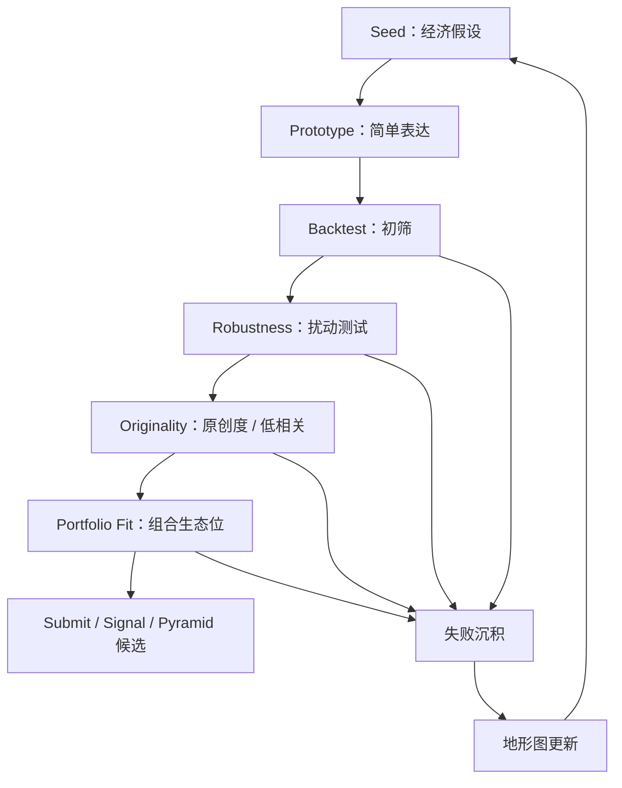

# Alpha 登山育苗协议 v0

来源：Notion《Alpha 登山育苗协议 v0》。沉降时间：2026-06-05。

## r / N / D

- r：Alpha 研究面对复杂系统，回测只是过去有效的证据，不是未来有效的证明。
- N：可复用的是育苗流程、停手规则、失败沉积格式与 AI 角色边界。
- D：Notion 继续作为 WQB 当期研究现场；GitHub 沉协议地层。

## 核心判断

所有 Alpha 都带有“后视镜开车”的问题：回测只能说明某个信号在过去某段历史中曾经有效，不能直接证明它会继续有效。

目标不是找一个历史分数最高的表达式，而是建立制度：让坏 Alpha 尽早死、死得明白；让好 Alpha 不是因为单点高分留下，而是因为它在经济机制、简单性、稳健性、原创度和组合贡献上连续存活。

## Alpha 登山六亭



## 六亭判准

### Seed：经济假设亭

进入条件：能用一句话回答“谁在什么时候，因为什么原因，没有充分定价什么信息？”

淘汰条件：只说字段回测好；解释不出市场行为；完全依赖黑箱模型分数；没有方向预期。

必填：市场行为、非有效性类型、预测方向、预期时间尺度、可能反证。

### Prototype：简单表达亭

目标：用最少结构表达假设。第一版 Alpha 应该是探针，不是机器。

复杂度预算：operator 少、parameter 少、nesting depth 浅、data family 不乱拼、conditional logic 少、不让效果全靠 neutralization 修出来。

必填：最小表达思路、使用数据族、使用变换、为什么表达忠于假设、复杂度风险。

### Backtest：初筛亭

初筛只决定“能不能去下一亭”，不能证明它是真的。指标分组：收益质量、交易可行性、平台资格。

淘汰条件：初始性能过低；指标好但交易不可行；只靠单一异常窗口活着；明显不满足活动 / 平台资格。

### Robustness：扰动亭

扰动维度：参数、时间、universe、neutralization、极值处理、region、数据时间。

判断原则：不要求处处强，但死法必须符合原理；随机活、随机死，优先判为噪声。

### Originality：原创度 / 低相关亭

原创度是边际信息：与自己旧 Alpha 低相关，与平台常见 Alpha 低相关，数据源有新增信息，时间尺度不同，经济机制不同，加入组合后仍有贡献。

### Portfolio Fit：组合生态位亭

判断它放进种群后是否改善整体：active alphas 相关性、Combined Alpha Performance 边际贡献、drawdown、数据族依赖、region / horizon / style 补洞。

## 育苗法

不要走“生成 1 个 Alpha → 回测 → 改 → 再改”的盆景路线。

推荐：1 个经济假设 → 3 个数据视角 → 每个视角 3 个简单表达 → 每个表达 2–3 个时间尺度 → 18–27 个候选苗。

优先级：稳定弱簇 > 单点强苗；简单可解释 > 复杂高分；跨扰动存活 > 单设置爆炸；低相关边际贡献 > 高相关高 Sharpe；符合经济死法 > 随机活随机死。

## 停止规则

- 停止收集信息：当前信息足以决定下一步小行动；新增信息不会改变下一步选择；信息只是在增加安全感，不增加判断力；已经知道下一轮失败如何记录。
- 停止优化：性能提升只来自参数微调；复杂度上升但机制没有变清；相关性下降不了；样本外 / 扰动不稳定；继续优化只是为了证明自己能行动。
- 停止提交：没有通过原创度亭；不知道组合生态位；只是因为分数漂亮而想提交；活动规则 / eligibility 未确认；失败后无法沉积。

## 失败沉积格式

```plain text
失败编号：
所属母题：
失败亭子：
失败类型：机制错 / 数据错 / 表达错 / 时间尺度错 / 初筛弱 / 扰动崩 / 相关性高 / 组合无贡献 / 平台规则不过
关键证据：
是否改变地形图：
下次避免：
是否沉 GitHub：
```

## AI 的角色

- 外置记忆：记录为什么开始、试过哪些数据、死在哪里、下次不要重复什么。
- 反抽象装置：把“情绪有效”“市场变了”“这个数据不错”拆成机制、市场、时间尺度与反证。
- 停止规则守门员：提醒现在是在研究，还是在证明自己能行动。
- 失败沉积员：把失败转成结构，避免退相干成噪声。

## Ξ 声明 / 折叠审计

- 已沉 Git：研究协议、六亭、停止规则、失败沉积格式。
- 留 Notion：当期 WQB 主题、字段查询现场、simulation 结果、账号相关操作边界。
- 不外运：平台凭证、私密账号状态、未授权 simulation / submit 细节。
