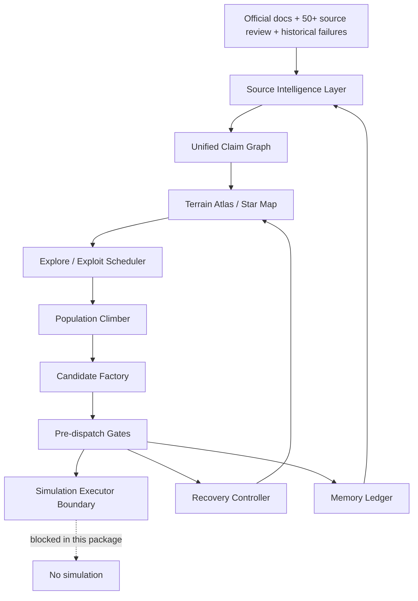
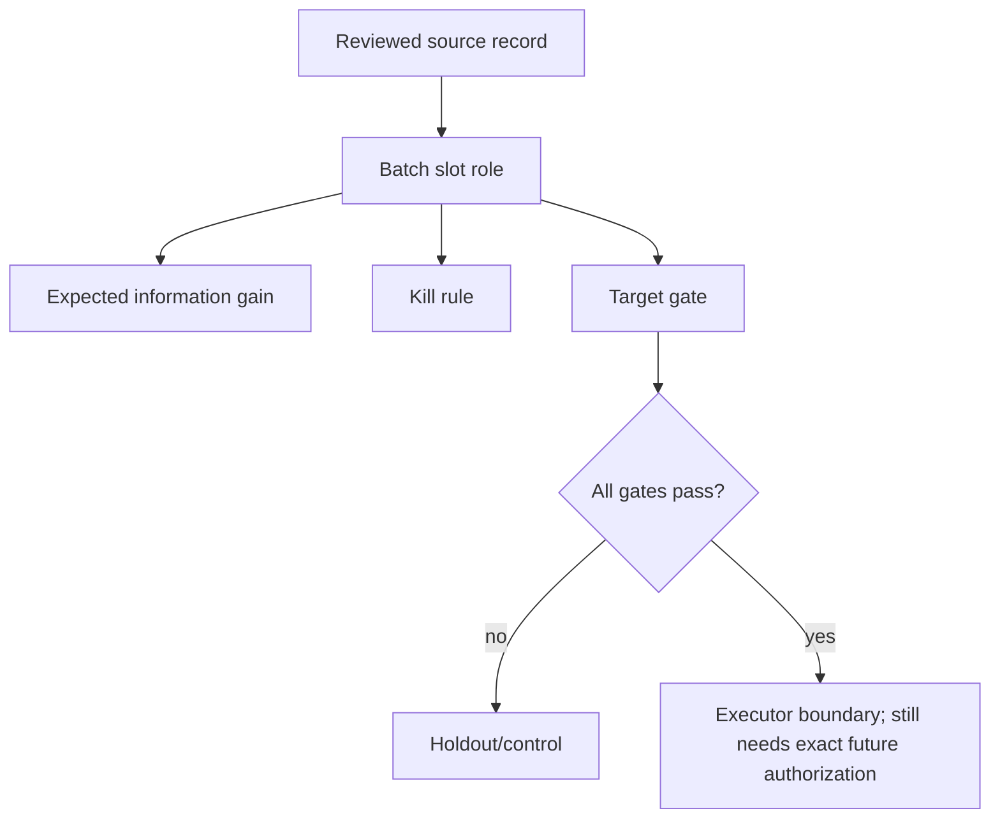
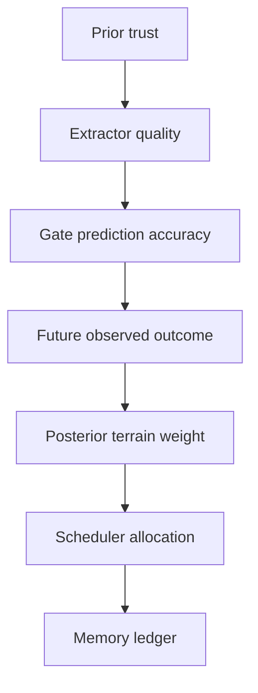

# WQB Alpha Research Flywheel System Design

Updated: 2026-06-23T13:18:56+08:00

Status: design package only. No simulation. No submit. No ready packet.

## Boundary

This design does not materialize alpha text, dispatch WQB simulations, submit alphas, call forum write tools, store credentials, or copy community expressions. It creates recoverable design and validation artifacts for the next round.

## Overall architecture



## Flywheel


## Batch slot role



## Claim to Candidate


## Terrain update



## Layer contracts

| Layer | Input | Output | Decision rule | Failure mode | Improvement next run |
|---|---|---|---|---|---|
| Source Intelligence Layer | official/community/failure sources | scored source records | evidence, not votes, controls usability | score inflation | separates importance and evidence |
| Claim Graph | reviewed sources | claim nodes and edges | merge by mechanism and gate | generic duplicates | reusable evidence map |
| Terrain Atlas / Star Map | claim graph + failures | axes by field, operator, horizon, neutralization, blocker | allocate by evidence + uncertainty | local overfit | avoids repeated micro-repair |
| Explore / Exploit Scheduler | terrain weights | slot roles | non-holdout slots need strong source or stay not-ready | weak-only slot | protects budget |
| Population Climber | mechanisms | typed variants | mutate mechanisms, not copied text | copy risk | family-level learning |
| Candidate Factory | slot + source refs | draft specs without alpha text | source ref / gate / info gain / kill rule required | missing field refs | auditability |
| Pre-dispatch Gates | draft specs | pass/fail blockers | field, duplicate, hash, copy firewall, validator required | budget waste | blocks premature dispatch |
| Simulation Executor Boundary | future gate-passed packet | none now | requires exact future authorization | accidental simulation | clean boundary |
| Recovery Controller | failed gates | repair tasks | repair source/extractor/gates first | retry loop | recoverable next action |
| Gate-aware Scorer | gate predictions | priority score | score information gain and blocker relevance | Sharpe-only thinking | better slot allocation |
| Bayesian Terrain Update | future validated evidence/outcomes | posterior trust | prior and posterior separated | overtrust | learning accumulates |
| Memory Ledger | artifacts/run-state | recoverable state | record blockers and do-not-next | forgotten constraints | clean continuation |

## Core schemas

```json
{
  "source_record": {
    "review_record_id": "SCR-011",
    "source_id": "forum:36947868698519",
    "bucket": "alpha_design_strong",
    "allowed_use": "prod_corr originality precheck method",
    "forbidden_use": "bulk mining or expression copying"
  },
  "claim_node": {
    "claim_node_id": "CLAIM-PROD-CORR-PIVOT",
    "source_refs": ["SCR-011"],
    "mechanism": "prod_corr triggers originality/mechanism/data-family pivot",
    "gate_targets": ["PROD_CORRELATION", "SELF_CORRELATION"]
  },
  "slot_spec": {
    "slot_id": "F01",
    "source_claims": [{"review_record_ref": "SCR-011"}],
    "expected_information_gain": "identify whether originality pivot is required",
    "kill_rule": "kill local family if correlation remains dominant"
  }
}
```