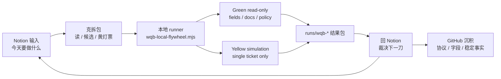

# WQB local flywheel v0.1

日期：2026-06-13  
状态：本地可跑包 / 黄灯生产线  
位置：`scripts/wqb-local-flywheel.mjs`

## 0. 一句话

WQB 这条线不是“把 MCP 部署到 Cloudflare 就结束”。MCP 的用途是把 Notion 里的当日意图，压成一个本地可运行、可回收、可交接的研究飞轮：

```text
Notion 当日指令
→ 克拆成 read / candidate / ticket / readback
→ 本地 runner 跑 read-only 或单次授权 simulation
→ runs/wqb-*/ 产出结果包
→ 回到 Notion 继续裁决下一刀
→ 稳定事实沉 GitHub
```

## 1. 为什么要有本地包

WQB 平台有时间压力，不能把每一步都卡在完整架构设计上。  
但 WQB 又涉及账号、simulation、submit 与凭证边界，不能裸奔。

所以当前正确形态是：

- Notion：现场对话、当天目标、裁决与下一刀。
- 本地：真实 runner、凭证、simulation 执行、结果包。
- GitHub：协议、脚本、runbook、稳定地层。
- Cloudflare：以后做远程闸门，不阻塞当前本地生产。

## 2. 飞轮



读图：Cloudflare 不在当前内环里。当前内环是 Notion → 本地 → Notion；Cloudflare 只是未来把本地能力远程化时的闸门。

## 3. 本地环境

二选一配置 MCP 入口。

### HTTP 入口

```bash
export WQB_MCP_HTTP_URL="http://127.0.0.1:8787/mcp"
```

### stdio 入口

```bash
export WQB_MCP_CMD="python"
export WQB_MCP_ARGS='["-m","cnhkmcp"]'
```

如果 dumber 那边已经有自己的本地 MCP 启动命令，就只需要把它映射成上面的 `WQB_MCP_CMD / WQB_MCP_ARGS` 或本地 HTTP URL。

## 4. 当天最小跑法

### 4.1 建计划包

```bash
node scripts/wqb-local-flywheel.mjs plan --today "推进 WQB：Sales EDS 字段 → 一个候选表达式"
```

输出：

```text
runs/wqb-*/plan.md
```

### 4.2 先跑 read-only smoke

```bash
node scripts/wqb-local-flywheel.mjs smoke-readonly
```

输出：

```text
runs/wqb-*/smoke-readonly.json
```

这个阶段会尝试：

- tools/list
- health
- policy
- tools
- config_status
- auth_status

默认脱敏，不输出 cookie / token / password。

### 4.3 查 dataset / field

```bash
node scripts/wqb-local-flywheel.mjs dataset-brief --search Sales --limit 5
node scripts/wqb-local-flywheel.mjs field-brief --datasetId analyst4 --search Sales --limit 20
```

输出：

```text
runs/wqb-*/dataset_brief.json
runs/wqb-*/field_brief.json
```

### 4.4 生成 simulation 黄灯票，不运行

```bash
node scripts/wqb-local-flywheel.mjs ticket-sim \
  --expression-file ./candidate.fast \
  --settings-json '{"region":"USA","universe":"TOP3000","delay":1,"neutralization":"SUBINDUSTRY","truncation":0.08}'
```

输出：

```text
runs/wqb-*/simulation-ticket.json
runs/wqb-*/simulation-ticket.md
```

### 4.5 单次授权后才运行 simulation

```bash
node scripts/wqb-local-flywheel.mjs run-sim \
  --ticket runs/wqb-*/simulation-ticket.json \
  --yes-i-authorize-simulation
```

输出：

```text
runs/wqb-*/simulation-created.json
```

### 4.6 读回 simulation

```bash
node scripts/wqb-local-flywheel.mjs read-sim --simulationId SIM_ID
```

输出：

```text
runs/wqb-*/simulation-read.json
```

### 4.7 打包给 Notion

```bash
node scripts/wqb-local-flywheel.mjs pack --run-dir runs/wqb-YYYY-MM-DD...
```

输出：

```text
runs/wqb-*/handoff.md
```

把 handoff.md 里的提示词贴回 Notion，克继续读结果、裁决下一刀。

## 5. 工具边界

### Green：默认可跑

- health
- policy
- tools
- config_status
- auth_status
- get_datasets
- get_datafields
- dataset_brief
- field_brief
- get_documentations
- get_documentation_page

### Yellow：本地单次授权

- create_simulation
- create_multi_simulation
- get_simulation

当前脚本只直接开放单个 `create_simulation`。multi simulation 先不放进默认命令。

### Red：脚本拒绝

- submit_alpha
- set_alpha_properties
- delete_alpha
- modify_alpha
- credential_export
- cookie_export
- autonomous_bulk_mining

## 6. 克在 Notion 里的默认循环

以后谷在 Notion 里给一句：

```text
今天推进 WQB：做 X，交 Y。
```

克应该自动拆成：

1. **读**：需要查 dataset / field / docs / policy 里的哪一个？
2. **候选**：今天只压一个候选表达式、字段判断或失败沉积。
3. **本地包**：给出本地命令，不把凭证拿进聊天。
4. **黄灯票**：如果要 simulation，生成 ticket，不直接运行。
5. **回收**：让本地跑包回到 `runs/wqb-*`。
6. **裁决**：继续、改、停、沉 GitHub。
7. **沉积**：稳定字段 / 协议 / runbook 进 GitHub；现场结果留 Notion / 本地。

## 7. 当前不做

- 不部署 Cloudflare。
- 不 submit alpha。
- 不保存明文密码。
- 不暴露全部工具。
- 不自动批量挖矿。
- 不把 simulation 授权复用到下一批。
- 不把 WQB 私密页面全文沉 GitHub。

## 8. 下一步验收

- [ ] 在本地把 dumber / CNHKMCP 启动命令映射成 `WQB_MCP_CMD` 或 `WQB_MCP_HTTP_URL`。
- [ ] `node scripts/wqb-local-flywheel.mjs smoke-readonly` 产出 redacted JSON。
- [ ] `dataset-brief / field-brief` 能读 Sales EDS。
- [ ] 用一个候选表达式生成 `simulation-ticket.json`。
- [ ] 只有加 `--yes-i-authorize-simulation` 才能创建 simulation。
- [ ] `pack` 能生成 Notion handoff。