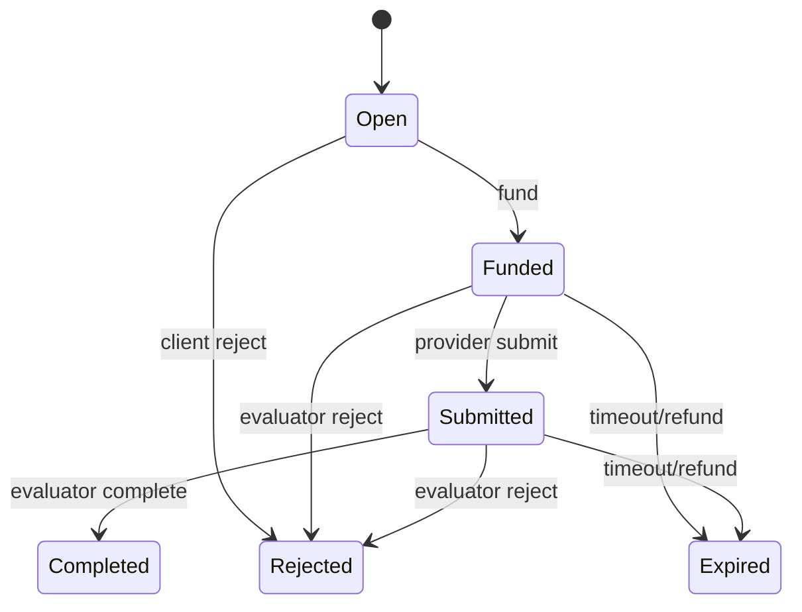
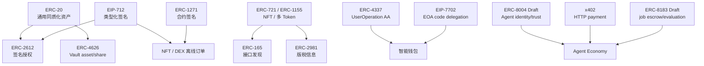

# 常用 ERC / EIP 标准整理

> 状态基于 Ethereum EIPs 官方站点 **2026-10-06** 的公开页面。实现前仍应重新确认标准状态与目标链/协议的实际版本。

## 0. 先分清 EIP、ERC 和外部协议

**EIP（Ethereum Improvement Proposal）** 是以太坊改进提案总体系，包含 Core、Networking、Interface、ERC、Meta、Informational 等类别。

**ERC（Ethereum Request for Comments）** 是 Standards Track 中面向应用层的标准类别，例如 token、NFT、账户、签名验证等。

因此：

- ERC-20、ERC-721、ERC-4337 等都是 EIP 体系里的 **ERC 类标准**；
- **EIP-712** 属于 Interface 标准，不应写成 ERC-712；
- **EIP-7702** 属于 Core EIP，不应写成 ERC-7702；
- **x402 不是 EIP / ERC**，它是独立的互联网原生支付协议；HTTP `402 Payment Required` 是其核心入口，当前规范也定义了 MCP / A2A 等传输表示。

---

# 1. 总览

| 标准 | 当前状态 | 一句话含义 | 典型场景 |
|---|---|---|---|
| ERC-20 | Final | 同质化 token 标准 | DEX、借贷、支付 |
| ERC-2612 | Final | 用 EIP-712 签名执行 ERC-20 `permit` 授权 | 减少 approve 交易 |
| ERC-721 | Final | 非同质化 token（NFT） | NFT、V3 仓位包装 |
| EIP-712 | Final | 类型化结构数据签名/哈希 | permit、订单、授权 |
| ERC-4626 | Final | 单一 ERC-20 底层资产的 tokenized vault 标准 | Vault、收益聚合、借贷集成 |
| ERC-1155 | Final | 单合约管理多种 fungible/NFT token id | 游戏资产、NFT 批量操作 |
| ERC-165 | Final | 合约接口能力检测 | NFT / 多接口合约 |
| ERC-2981 | Final | NFT royalty 信息查询标准 | NFT 市场版税信息 |
| ERC-1271 | Final | 智能合约账户的签名验证标准 | Safe / smart account / NFT 订单 |
| ERC-4337 | Final | 不改共识层的 Account Abstraction | 智能账户、Bundler、Paymaster |
| EIP-7702 | Final | EOA 通过授权设置代码委托能力 | 批处理、gas sponsorship、智能钱包 |
| ERC-8004 | **Draft** | Agent 身份、信誉、验证注册表 | AI Agent 发现与信任 |
| x402 | 外部协议 | 用 HTTP 402 协商并完成网络原生支付 | API / Agent 按次支付 |
| ERC-8183 | **Draft** | Agent 任务预算托管 + evaluator 验收结算 | Agent 商务任务 |

---

# 2. DEX（Uniswap）相关

## 2.1 ERC-20 — Token Standard

### 解决什么问题

为同质化 token 定义统一接口，让钱包、DEX、借贷协议不必为每种 token 写一套适配器。

### 核心接口

```solidity
function totalSupply() external view returns (uint256);
function balanceOf(address account) external view returns (uint256);
function transfer(address to, uint256 value) external returns (bool);
function allowance(address owner, address spender) external view returns (uint256);
function approve(address spender, uint256 value) external returns (bool);
function transferFrom(address from, address to, uint256 value) external returns (bool);
```

核心事件：

```solidity
event Transfer(address indexed from, address indexed to, uint256 value);
event Approval(address indexed owner, address indexed spender, uint256 value);
```

### 在 DEX 中怎么用

用户通常先 `approve(router, amount)`，Router 再通过 `transferFrom` 把 token 拉入 Pair / Pool。

### 必须记住

- `approve` 是授权额度，不是转账；
- `transferFrom` 消耗 allowance；
- token 实现并不总完全规范，生产集成常使用安全包装处理“不返回 bool”等历史兼容问题；
- allowance 过大意味着 Router/Spender 权限扩大，授权对象本身必须可信。

官方：https://eips.ethereum.org/EIPS/eip-20

---

## 2.2 ERC-2612 — Permit Extension for EIP-20 Signed Approvals

### 解决什么问题

普通 ERC-20 授权流程通常需要：

```text
approve 交易 -> 等确认 -> 业务交易
```

ERC-2612 增加 `permit`：token owner 在链下签 EIP-712 消息，第三方可把签名提交上链完成 allowance 更新。

### 核心接口

```solidity
function permit(
    address owner,
    address spender,
    uint256 value,
    uint256 deadline,
    uint8 v,
    bytes32 r,
    bytes32 s
) external;

function nonces(address owner) external view returns (uint256);
function DOMAIN_SEPARATOR() external view returns (bytes32);
```

### 防重放靠什么

签名消息包含：

- `owner`
- `spender`
- `value`
- `nonce`
- `deadline`
- EIP-712 domain

每次成功执行后 nonce 改变，旧签名不能重复使用。

### 必须记住

**permit 不是“免费的链上操作”。** 用户可以不自己先发 approve 交易，但仍需要某个 relayer / 应用交易把签名提交链上。

官方：https://eips.ethereum.org/EIPS/eip-2612

---

## 2.3 ERC-721 — Non-Fungible Token Standard

### 解决什么问题

每个 `tokenId` 都代表唯一资产，与 ERC-20 的可互换余额模型不同。

### 核心概念

```text
ownerOf(tokenId)
balanceOf(owner)
approve(to, tokenId)
setApprovalForAll(operator, approved)
transferFrom(...)
safeTransferFrom(...)
```

`safeTransferFrom` 给合约接收方时要求对方实现 ERC-721 receiver 回调，避免 NFT 被误转进无法取出的合约。

### 与 Uniswap 的关系

V2 LP 份额是 ERC-20；V3 Core position 本身不是 NFT，但常由 Periphery 的 `NonfungiblePositionManager` 包装成 ERC-721，原因是不同 LP 仓位的 tick range、fee tier、流动性数量等参数不同，不能再天然视为同质份额。

官方：https://eips.ethereum.org/EIPS/eip-721

---

## 2.4 EIP-712 — Typed Structured Data Hashing and Signing

### 解决什么问题

相比让用户签一个不可读的任意 `bytes32`，EIP-712 定义**有类型、有结构、有 domain 的签名消息**。

核心模型：

```text
EIP712Domain
    +
struct typeHash + field values
    ↓
structured-data digest
    ↓
wallet signature
```

Domain 常包含：

```text
name
version
chainId
verifyingContract
salt（可选）
```

### 为什么重要

它是许多“链下签名、链上验证”协议的底层语言，例如：

- ERC-2612 permit；
- DEX 离线订单；
- NFT 市场订单；
- Account Abstraction 中的部分签名结构；
- Agent 标准里的授权/证明。

### 最容易错的点

**EIP-712 本身不自动提供 replay protection。**

nonce、deadline、chainId、verifying contract、订单状态等防重放机制需要具体协议自行设计。

官方：https://eips.ethereum.org/EIPS/eip-712

---

# 3. 借贷 / Vault（Aave 语境）相关

ERC-20、ERC-2612、EIP-712 的含义同上。这里重点补 ERC-4626。

## 3.1 ERC-4626 — Tokenized Vault Standard

### 解决什么问题

统一“存入一种 ERC-20 底层资产，收到 vault share；赎回 share，取回资产”的接口。

两个关键对象：

```text
asset  = vault 管理的底层 ERC-20
share  = 用户持有的 vault ERC-20 份额
```

所有 ERC-4626 vault 的 share 本身必须实现 ERC-20。

### 关键只读接口

```solidity
asset()
totalAssets()
convertToShares(assets)
convertToAssets(shares)
maxDeposit(receiver)
maxMint(receiver)
maxWithdraw(owner)
maxRedeem(owner)
previewDeposit(assets)
previewMint(shares)
previewWithdraw(assets)
previewRedeem(shares)
```

### 四个状态变更动作

```text
deposit(assets, receiver)   精确资产输入
mint(shares, receiver)      精确 share 输出
withdraw(assets, receiver, owner) 精确资产输出
redeem(shares, receiver, owner)   精确 share 输入
```

### 为什么借贷协议需要理解它

它让 aggregator、钱包和其他 DeFi 协议可以用统一方式集成“资产 ↔ 收益份额”产品，而不用为每种 vault 单独适配。

### 安全要点

- share price、rounding 和 donation/inflation attack；
- `preview*` 是预览，执行时仍可能受状态变化影响；
- 集成方需要自己的最小/最大边界，不能把 preview 当成交保证；
- ERC-4626 是通用 vault 标准，**不能反推“所有 Aave token 都是 ERC-4626”。** 应检查具体产品/合约实现。

官方：https://eips.ethereum.org/EIPS/eip-4626

---

# 4. NFT 市场（OpenSea 语境）相关

这里表示 NFT 市场常需要理解的标准，不等于断言某个平台的每条当前执行路径都只使用这些标准。

## 4.1 ERC-1155 — Multi Token Standard

### 解决什么问题

一个合约可以管理很多 `id`，每个 `id` 的供应量可不同，因此既能表示：

- fungible token；
- NFT；
- semi-fungible token。

### 关键能力

```text
balanceOf(account, id)
balanceOfBatch(...)
safeTransferFrom(...)
safeBatchTransferFrom(...)
setApprovalForAll(...)
```

批量查询与批量转账是相较 ERC-721 的重要优势。

官方：https://eips.ethereum.org/EIPS/eip-1155

---

## 4.2 ERC-165 — Standard Interface Detection

### 解决什么问题

合约可以公开回答：

```solidity
supportsInterface(bytes4 interfaceId)
```

调用方据此判断它是否支持某个标准接口，而不是靠猜 ABI。

ERC-721、ERC-1155 等标准都使用 ERC-165 做接口发现。

官方：https://eips.ethereum.org/EIPS/eip-165

---

## 4.3 ERC-2981 — NFT Royalty Standard

### 解决什么问题

给定 NFT 和成交价格，统一查询“建议把多少 royalty 支付给谁”：

```solidity
royaltyInfo(tokenId, salePrice)
    -> (receiver, royaltyAmount)
```

### 最重要的边界

ERC-2981 **只标准化 royalty 信息发现，不负责强制支付。**

市场是否执行、如何执行 royalty，是市场/交易协议层面的决定。

官方：https://eips.ethereum.org/EIPS/eip-2981

---

## 4.4 ERC-1271 — Standard Signature Validation Method for Contracts

### 解决什么问题

EOA 可以用 `ecrecover` 验证 ECDSA 签名，但 Safe、多签、智能账户等合约账户没有一个天然私钥对应地址。

ERC-1271 让合约自己定义“这个签名是否代表我授权”：

```solidity
isValidSignature(bytes32 hash, bytes signature)
```

有效时返回 magic value：

```text
0x1626ba7e
```

### 为什么 NFT 市场很重要

订单签名人可能是合约钱包而不是 EOA。市场若只支持 `ecrecover`，就会错误排除智能账户。

官方：https://eips.ethereum.org/EIPS/eip-1271

---

# 5. 钱包（MetaMask 语境）相关

## 5.1 ERC-4337 — Account Abstraction Using Alt Mempool

### 目标

让用户把**智能合约账户**作为主要账户，并自定义验证逻辑，同时不要求以太坊共识层新增一种原生 AA 交易。

### 核心对象

```text
Smart Account
UserOperation
Bundler
EntryPoint
Paymaster（可选）
Factory（常用于账户部署）
```

### 简化流程

```text
用户创建 UserOperation
        ↓
发送到独立 UserOp mempool
        ↓
Bundler 收集多个 UserOperation
        ↓
Bundler 调 EntryPoint.handleOps(...)
        ↓
EntryPoint 验证账户 / Paymaster 并执行
```

### 能带来什么

- 自定义签名 / 多签 / 社交恢复；
- 批量调用；
- Paymaster 代付 gas；
- session key 等更灵活授权模型。

官方：https://eips.ethereum.org/EIPS/eip-4337

---

## 5.2 EIP-7702 — Set Code for EOAs

### 分类先纠正

EIP-7702 是 **Core EIP**，不是 ERC。

### 解决什么问题

给 EOA 引入代码委托能力。新的交易类型包含 authorization list，EOA 可以授权把自己的执行逻辑委托到某个实现代码地址。

直觉上，可以理解为：

```text
EOA 地址/资产关系继续保留
        +
获得一部分智能账户式可编程执行能力
```

### 典型能力

- 一笔交易批量完成多个操作；
- gas sponsorship；
- 更细权限控制；
- 让传统 EOA 更平滑地迁移到智能钱包体验。

### 与 ERC-4337 的关系

二者不是简单互斥替代：

- 4337 建立 UserOperation / Bundler / EntryPoint 的高层 AA 基础设施；
- 7702 在协议层给 EOA 增加代码委托能力；
- 当前 ERC-4337 规范已经把 EIP-7702 纳入所需/兼容机制之一。

### 安全重点

用户签的 authorization 本质上可以改变账户后续执行能力，因此必须明确：

- 委托给哪个代码；
- chain/domain；
- nonce；
- 委托实现是否安全、可升级；
- 钱包 UI 是否让用户真正看懂授权后果。

官方：https://eips.ethereum.org/EIPS/eip-7702

---

# 6. AI + Web3

这一组最适合按三层理解：

```text
ERC-8004：我是谁？别人凭什么信我？
        ↓
x402：这次 API / 服务怎么付款？
        ↓
ERC-8183：一个有交付和验收的任务，钱怎么托管与结算？
```

它们解决不同问题，不应混成一个“Agent 支付标准”。

## 6.1 ERC-8004 — Trustless Agents（Draft）

> **2026-10-06 状态：Draft。**

### 目标

让跨组织、没有预先信任关系的 Agent 可以被发现，并获得可组合的信任信号。

规范提出三个主要 Registry：

### 1）Identity Registry

基于 ERC-721 给 Agent 一个链上身份：

```text
agentRegistry + agentId
        ↓
agentURI
        ↓
Agent registration file
```

registration file 可以声明：

- 名称、描述、图片；
- Web / A2A / MCP / OASF / ENS / DID 等 endpoint；
- 是否支持 x402；
- 支持哪些 trust model。

### 2）Reputation Registry

标准化客户端对 Agent 提交 feedback 的链上接口，让外部系统可以按 client/tag 等维度组合信誉信号。

### 3）Validation Registry

记录第三方 validator 对某次 Agent 工作的验证请求与结果，可承接 re-execution、zkML、TEE 等不同验证机制。

### 最关键的边界

**ERC-8004 明确把支付视为 orthogonal（正交问题），不负责支付。**

规范只给出 x402 payment proof 可如何进入 feedback 的例子。

官方：https://eips.ethereum.org/EIPS/eip-8004

---

## 6.2 x402 — 互联网原生支付协议（不是 ERC/EIP）

### 目标

让服务端表达“这个资源需要付款”，客户端程序化构造支付授权、验证并结算。HTTP 场景使用 `402 Payment Required`；当前 x402 v2 还把核心类型/支付逻辑与传输表示分离，可在 HTTP、MCP、A2A 等传输上承载。

概念流程：

```text
Client -> GET /resource
Server -> HTTP 402 + payment requirements
Client -> 构造/签署支付授权
Client -> 携带 payment proof/authorization 再次请求
Server / facilitator -> 验证并结算
Server -> 返回资源
```

### 为什么适合 Agent

Agent 调 API 时可以程序化处理：

```text
发现价格 -> 判断是否愿意付 -> 授权 -> 付款 -> 获得结果
```

不需要人工注册账号、充值平台余额再调用。

### 与 ERC-8004 / ERC-8183 的区别

- 不定义 Agent 身份/信誉；
- 不定义一个长期任务的交付、验收、退款状态机；
- 重点是“服务调用需要付款时，如何协商、授权、验证和结算”，而不是 Agent 身份或长期任务验收。

官方：https://x402.org/

---

## 6.3 ERC-8183 — Agentic Commerce（Draft）

> **2026-10-06 状态：Draft。**

### 目标

它比“支付”更接近**有任务、有预算、有交付、有验收的 escrow 结算协议**。

三个主要角色：

```text
client     出钱、创建任务
provider   执行并提交工作
evaluator  验收或拒绝
```

### 状态机



结算结果：

- `Completed`：托管资金支付给 provider（可扣平台费）；
- `Rejected`：退回 client；
- `Expired`：超时后退回 client。

支付资产使用 ERC-20。

### 为什么需要 evaluator

付款条件不是“provider 自己说做完”，而是：

```text
provider submit
      ↓
evaluator attests
      ↓
release / refund
```

Evaluator 可以是 client，也可以是第三方地址或执行验证逻辑的智能合约。

### 与 ERC-8004 的组合

ERC-8183 本身刻意不内建 reputation。任务完成/拒绝结果可以再作为 ERC-8004 的信誉/验证信号。

官方：https://eips.ethereum.org/EIPS/eip-8183

---

# 7. 场景关系图



---

# 8. 最容易混淆的知识点

## ERC-20 vs ERC-4626

ERC-20 只定义 token；ERC-4626 定义“底层 asset ↔ vault share”的金融语义和转换接口，share 本身又是 ERC-20。

## ERC-2612 vs EIP-712

EIP-712 是通用结构化签名格式；ERC-2612 是把 EIP-712 用于 ERC-20 allowance 的具体协议。

## ERC-721 vs ERC-1155

ERC-721 一 tokenId 一唯一资产；ERC-1155 一个合约可同时管理很多 id，且一个 id 可以有多个单位。

## ERC-1271 vs ECDSA / `ecrecover`

`ecrecover` 主要验证 EOA 签名；ERC-1271 让合约账户自行判定签名有效性。

## ERC-4337 vs EIP-7702

4337 是不改共识层的高层 AA 基础设施；7702 是 Core 层给 EOA 的代码委托能力。现实钱包可以组合二者。

## ERC-8004 vs x402 vs ERC-8183

- 8004：发现、身份、信誉、验证；
- x402：按请求支付；
- 8183：任务托管、提交、验收、结算/退款。

---

# 9. 建议记忆的最小接口集合

```text
ERC-20:
  balanceOf / transfer / approve / transferFrom / allowance

ERC-2612:
  permit / nonces / DOMAIN_SEPARATOR

ERC-721:
  ownerOf / approve / setApprovalForAll / safeTransferFrom

EIP-712:
  domain separator / type hash / hashStruct

ERC-4626:
  asset / totalAssets
  convertToShares / convertToAssets
  preview*
  deposit / mint / withdraw / redeem

ERC-1155:
  balanceOf / balanceOfBatch
  safeTransferFrom / safeBatchTransferFrom
  setApprovalForAll

ERC-165:
  supportsInterface

ERC-2981:
  royaltyInfo

ERC-1271:
  isValidSignature

ERC-4337:
  UserOperation / EntryPoint.handleOps
  account validation / Bundler / Paymaster

EIP-7702:
  authorization tuple / delegation code

ERC-8004:
  Identity / Reputation / Validation registries

x402:
  HTTP 402 -> payment requirements -> authorization/proof -> retry/settlement

ERC-8183:
  createJob / setBudget / fund / submit / complete / reject / claimRefund
```

---

## 官方资料

- Ethereum EIPs 总表：https://eips.ethereum.org/all
- ERC 仓库：https://github.com/ethereum/ERCs
- EIP 仓库：https://github.com/ethereum/EIPs
- ERC-20：https://eips.ethereum.org/EIPS/eip-20
- ERC-2612：https://eips.ethereum.org/EIPS/eip-2612
- ERC-721：https://eips.ethereum.org/EIPS/eip-721
- EIP-712：https://eips.ethereum.org/EIPS/eip-712
- ERC-4626：https://eips.ethereum.org/EIPS/eip-4626
- ERC-1155：https://eips.ethereum.org/EIPS/eip-1155
- ERC-165：https://eips.ethereum.org/EIPS/eip-165
- ERC-2981：https://eips.ethereum.org/EIPS/eip-2981
- ERC-1271：https://eips.ethereum.org/EIPS/eip-1271
- ERC-4337：https://eips.ethereum.org/EIPS/eip-4337
- EIP-7702：https://eips.ethereum.org/EIPS/eip-7702
- ERC-8004：https://eips.ethereum.org/EIPS/eip-8004
- ERC-8183：https://eips.ethereum.org/EIPS/eip-8183
- x402：https://x402.org/
