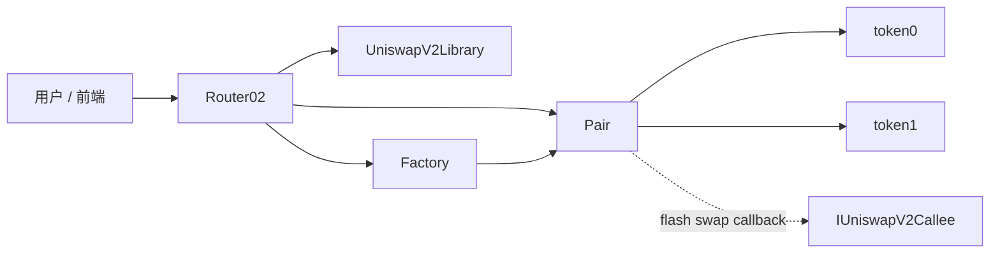

# Uniswap V2：AMM、交易风险、LP 与核心接口

## 1. AMM 的核心算法是什么？

Uniswap V2 使用 **Constant Product Market Maker（常数乘积做市商）**：

```text
x * y = k
```

其中：

- `x`：池中 token0 的储备；
- `y`：池中 token1 的储备；
- `k`：两边储备乘积；
- 当前池内边际价格（忽略 decimals）约为 `P(token0 in token1) = y / x`。

交易者不是在订单簿里寻找对手方，而是与流动性池交易。买走一种资产会减少它的储备、增加另一种资产的储备，于是价格沿着双曲线移动。

### 1.1 V2 的 0.3% 手续费

V2 对输入金额收取 0.3% 交易费。若输入为 `amountIn`，用于定价的有效输入为：

```text
amountInWithFee = amountIn * 997
```

精确输入时，Router / Library 的输出计算为：

```text
amountOut = amountInWithFee * reserveOut
          / (reserveIn * 1000 + amountInWithFee)
```

例如池中有 100 ETH 和 200,000 USDC，若忽略 decimals、用 USDC 买 ETH，则交易越大，成交均价越偏离交易前的 `2000 USDC / ETH`。

### 1.2 为什么不能简单理解为“实际储备永远满足同一个 k”？

手续费不会从池中拿走，而是留在池中归 LP 所有。因此成功交易后，实际储备乘积通常会增长。

`UniswapV2Pair.swap()` 的真实约束是对扣除输入手续费后的调整余额做检查：

```solidity
balance0Adjusted = balance0 * 1000 - amount0In * 3;
balance1Adjusted = balance1 * 1000 - amount1In * 3;

require(
    balance0Adjusted * balance1Adjusted
        >= reserve0 * reserve1 * 1000 ** 2,
    "UniswapV2: K"
);
```

所以更准确地说：**V2 以常数乘积曲线定价，并通过 fee-adjusted invariant 保证交易后不变量没有被破坏；手续费使池的实际 `k` 随交易累计而增长。**

### 1.3 `quote()` 和真实 swap 报价的区别

`quote(amountA, reserveA, reserveB)` 只按当前储备比例计算：

```text
amountB = amountA * reserveB / reserveA
```

它不包含手续费和由本次交易造成的价格影响。真正做 swap 时应使用 `getAmountOut` / `getAmountsOut` 或 `getAmountIn` / `getAmountsIn`。

---

## 2. 什么是滑点？如何避免滑点过高？

### 2.1 三个概念要分开

**价格影响（price impact）**：自己的交易改变池内储备，因此成交均价比交易前现价差。交易量相对池子越大，价格影响越大。

**市场滑点（market slippage）**：从看到报价到交易上链之间，其他交易改变了池内状态，实际可成交价格发生变化。

**滑点容忍度（slippage tolerance）**：用户愿意接受的最差执行边界。它不是滑点本身，而是保护交易的参数。

以 `swapExactTokensForTokens` 为例：

```solidity
swapExactTokensForTokens(
    amountIn,
    amountOutMin,
    path,
    to,
    deadline
)
```

`amountOutMin` 就是最少必须收到多少输出 token。若链上执行时低于此值，交易回滚。

精确输出型交易则通过 `amountInMax` 限制最多愿意支付多少输入 token。

### 2.2 降低滑点的做法

1. **选择更深的流动性池和更优路由。** 同样的订单占池子储备比例越低，价格影响通常越小。
2. **把 `amountOutMin` / `amountInMax` 设成合理且较紧的边界。** 不要为了“保证成交”直接设成 `0` 或极宽范围。
3. **在价格剧烈波动时降低订单规模或等待市场稳定。** 大单可以考虑更优路由或分批，但公开拆成多笔交易也会增加 gas 和暴露 MEV 的次数，并非必然更好。
4. **设置合理的 `deadline`。** 避免一笔旧报价长时间仍可被执行。
5. **对大额交易使用有 MEV 保护的交易入口、私有交易通道或 intent / RFQ 类机制（若所在前端支持）。**

一个实用判断是：如果界面显示的 price impact 已经很高，单纯把 slippage tolerance 调大并没有解决问题，只是允许自己在更差的价格成交。

---

## 3. 什么是三明治攻击？如何降低风险？

三明治攻击（sandwich attack）是典型的 MEV 策略。攻击者观察到一笔尚未确认、且滑点空间足够大的用户 swap 后，将两笔自己的交易夹在用户交易前后：

```text
攻击者 front-run
        ↓
      用户 swap
        ↓
攻击者 back-run
```

以用户用 USDC 买 ETH 为例：

1. 攻击者先买 ETH，把 ETH 价格推高；
2. 用户随后在更差价格成交，但仍处在自己的 `amountOutMin` 容忍范围内；
3. 攻击者立即卖回 ETH，利用用户造成的进一步价格移动获利；
4. 用户承担更差成交价，攻击者利润来自这段可被利用的价格空间，扣除手续费和 gas 后仍需为正。

### 降低三明治风险

- **不要设置过宽的滑点容忍度。** 这是最直接的防线；允许的最差价格越差，攻击者可提取的空间越大。
- **使用深度更好的池和更小的相对订单规模。** 攻击者推动价格需要付出的成本更高。
- **使用受保护或私有 order flow。** 交易不先进入公开 mempool，可减少被普通搜索者提前看到的机会。
- **给交易设置明确的价格/数量边界和短 `deadline`。**
- **大额订单优先比较聚合器、RFQ、intent 等执行方式，而不是只在单一浅池里硬吃价格曲线。**

这些方法只能降低风险，不代表能在所有排序环境下绝对消除 MEV。

---

## 4. LP 的作用是什么？

LP（Liquidity Provider，流动性提供者）把两种资产按池子当前比例存入 Pair，为交易者提供可成交的库存。

V2 的 LP 主要承担四个作用：

1. **提供交易深度。** 储备越深，相同规模交易对价格的影响通常越小。
2. **获得 LP Token。** Pair 本身也是 ERC-20 合约；LP Token 表示对池子资产的按比例所有权。
3. **赚取交易手续费。** 0.3% swap fee 留在池内，使储备价值和 `k` 增长；LP 退出时按份额取回包含累计手续费的资产。
4. **承担库存重新平衡风险。** 套利者不断把池价拉回外部市场价，LP 的两种资产数量随相对价格变化而改变，这正是无常损失产生的来源。

### 4.1 LP Token 如何铸造？

第一次添加流动性：

```text
liquidity = sqrt(amount0 * amount1) - MINIMUM_LIQUIDITY
```

V2 永久锁定最初 `1000` 个最小 LP 单位，防止某些极端份额操纵问题。

后续添加流动性时：

```text
liquidity = min(
    amount0 * totalSupply / reserve0,
    amount1 * totalSupply / reserve1
)
```

也就是只能按当前池子比例获得份额，多放入而没有按比例匹配的资产不会凭空增加 LP 份额。

---

## 5. 什么是无常损失？如何计算？

无常损失（Impermanent Loss, IL）是：**同样初始资产，放进 AMM 做 LP 后的价值，与什么都不做、直接持有（HODL）相比产生的相对损失。**

它不是“绝对亏钱”的同义词。LP 可能仍然赚钱，只是赚得比单纯持有少。

对于 V2 这种 50/50 常数乘积池，忽略手续费，如果两种资产的相对价格变为原来的 `r` 倍，则：

```text
LP / HODL = 2 * sqrt(r) / (1 + r)

IL = 2 * sqrt(r) / (1 + r) - 1
```

### 例子

| 价格变化倍数 `r` | IL（忽略手续费） |
|---:|---:|
| 1.0 | 0% |
| 2.0 | -5.72% |
| 0.5 | -5.72% |
| 4.0 | -20.00% |
| 0.25 | -20.00% |

价格向上或向下偏离初始价格，只要偏离倍数相同，理论 IL 对称。

“无常”这个名字容易误导：如果价格之后回到初始相对价格，IL 可消失；如果在价格仍然偏离时撤出流动性，相对 HODL 的差额就已经体现在最终拿回的资产价值中。实际结果还必须把手续费、激励、gas 等因素一起计算。若把 IL 定义为上式中的负数，则相对单纯 HODL 的差额可概念化为：

```text
LP 相对 HODL 的差额 ≈ IL + 手续费收入 + 激励 - gas/其他成本
```

最终绝对盈亏则还要把两种资产本身的价格变化计入持仓估值。

---

# 6. Uniswap V2 Core / Periphery 架构



## 6.1 Core：最小可信结算层

Core 仓库的重点是 **Factory + Pair**：

- `UniswapV2Factory`：创建和索引交易对；管理协议费接收地址；
- `UniswapV2Pair`：保存储备、铸造/销毁 LP Token、执行 swap、累计价格、检查不变量；
- `UniswapV2ERC20`：LP Token 的 ERC-20 与 permit 风格授权；
- `IUniswapV2Callee`：flash swap 回调接口。

Core 的 `mint`、`burn`、`swap` 都是较低层接口。官方代码甚至明确提示这些低层函数应由执行必要安全检查的上层合约调用。

## 6.2 Periphery：用户友好的路由层

Periphery 的重点是：

- `UniswapV2Router01 / Router02`：添加/移除流动性、token/ETH swap、多跳路径、最小/最大金额与 deadline；
- `UniswapV2Library`：排序 token、推导 pair 地址、读取 reserves、计算 quote / amount in / amount out / 多跳路径；
- `WETH`：Router 在 ETH 与 ERC-20 形式 WETH 之间包装/解包；
- `Router02`：在 Router01 基础上增加 fee-on-transfer token 的支持。

Core 尽量保持不可变和最小；Periphery 可以承担更多 UX、安全参数和路由逻辑。

---

# 7. Core 核心接口文档

## 7.1 `IUniswapV2Factory`

| 接口 | 类型 | 含义 |
|---|---|---|
| `feeTo()` | view | 协议费接收地址；为零地址时协议费关闭 |
| `feeToSetter()` | view | 有权设置 `feeTo` 的地址 |
| `getPair(tokenA, tokenB)` | view | 查询两 token 对应 Pair 地址 |
| `allPairs(index)` | view | 按索引取 Pair |
| `allPairsLength()` | view | Pair 总数 |
| `createPair(tokenA, tokenB)` | write | 用 CREATE2 创建唯一 Pair |
| `setFeeTo(address)` | write | 设置协议费接收地址 |
| `setFeeToSetter(address)` | write | 转移协议费设置权 |

事件：

```solidity
event PairCreated(
    address indexed token0,
    address indexed token1,
    address pair,
    uint
);
```

### 协议费与 LP 交易费不是同一件事

用户 swap 的 0.3% 手续费首先进入池子、属于 LP。若 `feeTo` 开启，Pair 在流动性事件发生时根据 `sqrt(k)` 的增长额外铸造 LP Token 给协议费地址；核心代码的目标是捕获约 **1/6 的 `sqrt(k)` 增长对应价值**，而不是每笔 swap 当场把一部分 token 转走。

## 7.2 `IUniswapV2Pair`

### 只读状态

| 接口 | 含义 |
|---|---|
| `factory()` | 创建该 Pair 的 Factory |
| `token0()` / `token1()` | 按地址排序后的两种 token |
| `getReserves()` | `reserve0`、`reserve1`、最后更新时间戳 |
| `price0CumulativeLast()` | token0 价格的累计值，用于 TWAP |
| `price1CumulativeLast()` | token1 价格累计值 |
| `kLast()` | 最近一次流动性事件后的 `reserve0 * reserve1`，用于协议费计算 |
| `MINIMUM_LIQUIDITY()` | 固定为 `1000` |

### 状态变更接口

| 接口 | 作用 | 调用前通常需要做什么 |
|---|---|---|
| `mint(to)` | 根据 Pair 当前余额相对 reserves 的新增量铸造 LP Token | 先把两种 token 转进 Pair |
| `burn(to)` | 按 Pair 持有的 LP Token 销毁份额并转出两种资产 | 先把要销毁的 LP Token 转给 Pair |
| `swap(amount0Out, amount1Out, to, data)` | 输出 token，并在结尾检查实际输入与 K 不变量 | 上层应先计算可接受输出；若 `data` 非空还需处理回调 |
| `skim(to)` | 把“实际余额 - reserve”的多余 token 转走 | 用于余额与 reserve 不一致的特殊情况 |
| `sync()` | 把 reserve 强制更新为当前实际余额 | 用于余额变化后同步储备 |
| `initialize(token0, token1)` | Factory 部署 Pair 后初始化 token | 只能由 Factory 调用一次 |

### Pair 事件

```solidity
event Mint(address indexed sender, uint amount0, uint amount1);
event Burn(address indexed sender, uint amount0, uint amount1, address indexed to);
event Swap(
    address indexed sender,
    uint amount0In,
    uint amount1In,
    uint amount0Out,
    uint amount1Out,
    address indexed to
);
event Sync(uint112 reserve0, uint112 reserve1);
```

## 7.3 LP Token / permit 相关接口

Pair 同时实现 ERC-20 风格 LP Token：

```text
name / symbol / decimals
totalSupply / balanceOf / allowance
approve / transfer / transferFrom
```

并提供 EIP-712 签名授权所需的：

```text
DOMAIN_SEPARATOR
PERMIT_TYPEHASH
nonces(owner)
permit(owner, spender, value, deadline, v, r, s)
```

这样移除流动性时可以使用 Router 的 `removeLiquidityWithPermit` 等方法，把“先发一笔 approve，再发一笔 remove”压缩为签名 + 单次链上调用。

## 7.4 `IUniswapV2Callee`

当 `Pair.swap(..., data)` 的 `data.length > 0` 时，Pair 会先把输出 token 乐观转给 `to`，再调用：

```solidity
uniswapV2Call(
    address sender,
    uint amount0,
    uint amount1,
    bytes calldata data
)
```

接收方必须在同一笔交易结束前把足够输入资产归还 Pair，使手续费调整后的 K 检查通过。这就是 V2 flash swap 的基础。

---

# 8. Periphery 核心接口文档

## 8.1 `IUniswapV2Router01`

### 基础地址

```solidity
factory()
WETH()
```

### 添加流动性

```solidity
addLiquidity(...)
addLiquidityETH(...)
```

关键保护参数：

- `amountADesired` / `amountBDesired`：理想投入量；
- `amountAMin` / `amountBMin`：最低接受投入量；
- `to`：LP Token 接收者；
- `deadline`：截止时间。

### 移除流动性

```solidity
removeLiquidity(...)
removeLiquidityETH(...)
removeLiquidityWithPermit(...)
removeLiquidityETHWithPermit(...)
```

`amountAMin` / `amountBMin` 或 ETH 版本对应的最小值，是退出时的价格保护。

### Swap：精确输入型

```solidity
swapExactTokensForTokens(amountIn, amountOutMin, path, to, deadline)
swapExactETHForTokens(amountOutMin, path, to, deadline)
swapExactTokensForETH(amountIn, amountOutMin, path, to, deadline)
```

特征：输入固定，必须至少收到 `amountOutMin`。

### Swap：精确输出型

```solidity
swapTokensForExactTokens(amountOut, amountInMax, path, to, deadline)
swapTokensForExactETH(amountOut, amountInMax, path, to, deadline)
swapETHForExactTokens(amountOut, path, to, deadline)
```

特征：输出固定，通过 `amountInMax` 或实际发送 ETH 上限限制最坏输入成本。

### 报价工具

```solidity
quote(amountA, reserveA, reserveB)
getAmountOut(amountIn, reserveIn, reserveOut)
getAmountIn(amountOut, reserveIn, reserveOut)
getAmountsOut(amountIn, path)
getAmountsIn(amountOut, path)
```

多跳路径如：

```text
TOKEN_A -> WETH -> TOKEN_B
```

每一跳都按对应 Pair 的储备和 0.3% 费用依次计算。

## 8.2 `IUniswapV2Router02`

Router02 继承 Router01，并增加 fee-on-transfer token 场景：

```solidity
removeLiquidityETHSupportingFeeOnTransferTokens(...)
removeLiquidityETHWithPermitSupportingFeeOnTransferTokens(...)

swapExactTokensForTokensSupportingFeeOnTransferTokens(...)
swapExactETHForTokensSupportingFeeOnTransferTokens(...)
swapExactTokensForETHSupportingFeeOnTransferTokens(...)
```

普通 Router01 会基于理论输入/输出数组计算，而 fee-on-transfer token 在转账过程中会额外扣费，因此 Router02 的 supporting 版本改为根据 Pair 的实际余额变化推导输入，并在最终接收方余额上检查最小输出。

---

# 9. 一笔 V2 swap 的完整路径

以 `swapExactTokensForTokens` 为例：

1. 前端读取 reserves，调用报价函数估算 `amountOut`；
2. 用户决定 `amountOutMin` 和 `deadline`；
3. 用户先允许 Router 使用输入 token（`approve`，或特定场景使用签名授权）；
4. Router 将输入 token 转到第一个 Pair；
5. Router 按路径逐 Pair 调用 `swap`；
6. Pair 乐观输出 token；
7. Pair 读取真实余额，推导 `amountIn`；
8. Pair 扣除 0.3% fee 后检查 K；
9. 更新 reserves、价格累计值并发出 `Swap` / `Sync`；
10. 若最终输出小于用户的最小可接受值，Router 整笔交易回滚。

因此安全边界并不只在 Pair：**Core 保证资产守恒和不变量，Periphery 把用户的最小输出、最大输入、deadline、路径等执行约束带进交易。**

---

# 10. 阅读源码时最值得自己追一遍的函数

按顺序建议手工追踪：

1. `UniswapV2Library.getAmountOut()`：把常数乘积和 0.3% fee 写成公式；
2. `UniswapV2Router02.swapExactTokensForTokens()`：理解 `amountOutMin` 如何形成滑点保护；
3. `UniswapV2Router02._swap()`：理解多跳路由；
4. `UniswapV2Pair.swap()`：理解 optimistic transfer、flash callback、真实输入推导和 K 检查；
5. `UniswapV2Pair.mint()` / `burn()`：理解 LP Token 与池资产份额；
6. `UniswapV2Pair._update()`：理解 reserves 与累计价格；
7. `UniswapV2Pair._mintFee()`：理解可选协议费为何通过额外铸造 LP Token 收取。

---

## 参考

- Uniswap V2 Core：https://github.com/Uniswap/v2-core
- Uniswap V2 Periphery：https://github.com/Uniswap/v2-periphery
- `IUniswapV2Factory.sol`：https://github.com/Uniswap/v2-core/blob/master/contracts/interfaces/IUniswapV2Factory.sol
- `IUniswapV2Pair.sol`：https://github.com/Uniswap/v2-core/blob/master/contracts/interfaces/IUniswapV2Pair.sol
- `UniswapV2Pair.sol`：https://github.com/Uniswap/v2-core/blob/master/contracts/UniswapV2Pair.sol
- `IUniswapV2Router01.sol`：https://github.com/Uniswap/v2-periphery/blob/master/contracts/interfaces/IUniswapV2Router01.sol
- `IUniswapV2Router02.sol`：https://github.com/Uniswap/v2-periphery/blob/master/contracts/interfaces/IUniswapV2Router02.sol
